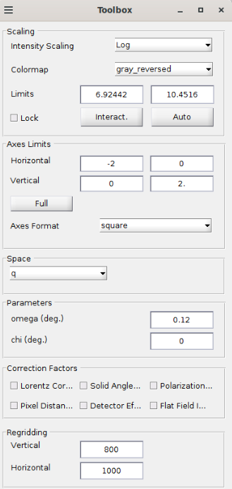
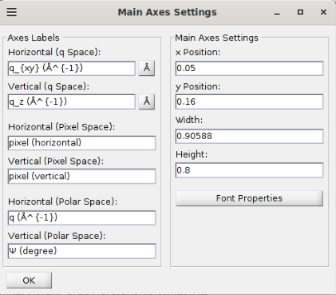
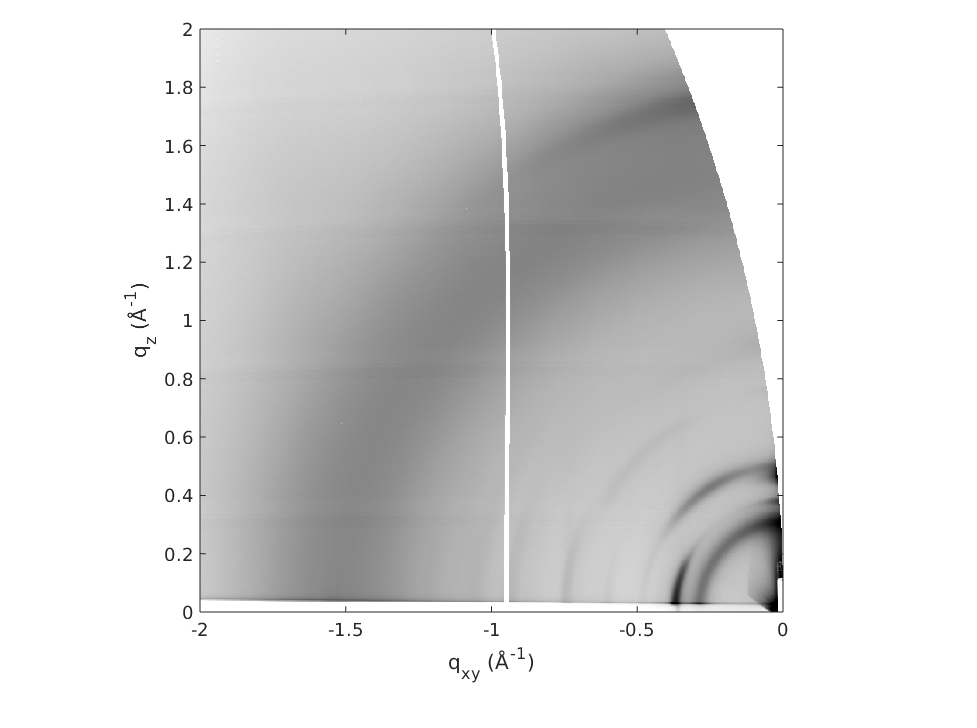

# Save the project & export the image

## Save Project
You can save your project by clicking on `File>Save Project`. In the window `Save Project`, click on the beamtime to include in your save (here only `Tutorial.mat`). You can add extra files to the archive that will be created, if needed. For example, you can include the images you have exported or the merged images you have created.

## Export image

You can set-up the image you see in the window `GIDVis` with the parameters in the window `Toolbox` (q range, color range, color map ...):

You can set the axis (large font range, shift the image) with the menu `Tools>Axes Settings`:

Then on `File>Save Image` you have extra parameters for the image display. Click on `Export` to export the image, here for example:

Unfortunately, GIDVis does not offer a proper way to export the image as a raw 2D matrix that could be imported in another software.

If you've missed any steps of this tutorial, you can download the file corresponding to the current tutorial

[comment]: [OTHER](../../../_static/giwaxs/gidvis/tutorial.GIDzip).
