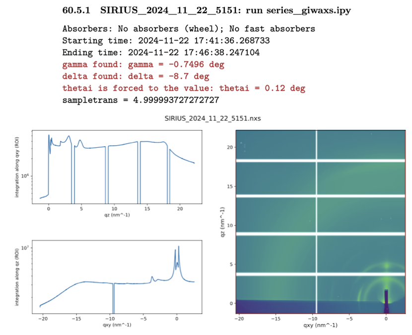

# Getting started

## Raw data & link to the notebook

In this tutorial, we use data acquired on a thin film of nonfullerene acceptors deposited on a silicon wafer, of interest for the field of organic photovoltaics. All the raw data required for this tutorial can be downloaded [here](../../../_static/giwaxs/raw_data.zip).

It consists of TIFF files that are the integrated images output from our 2D detector. To know the details of each file from your experiment, you need to refer to the electronic notebook. Below is a screenshot of the notebook corresponding to scan 5151:

You see several pieces of information that will be useful for the conversion to q-space:
- The full file name: `SIRIUS_2024_11_22_5151`
- The script that launched this scan: `series_giwaxs.ipy`. You need to look inside the script to determine the total integration time (here, 330 s).
- The starting and ending time of the scan.
- The value of the out-of-plane angle of the detector, `gamma`.
- The value of the in-plane angle of the detector, `delta`.
- The value of the incidence angle, `thetai`.
- A 2D image of the integrated image in an **approximate** q-map.

It is important to note that some approximations are made to display the image in reciprocal space (in particular, the missing wedge at small $q_{xy}$ values is not accounted for, see {cite:p}`werzer2024`). **The map cannot be used as such for peak extraction or publication purposes.**

Also, note the white lines on the image. These are the dead zones of the 2D detector, originating from the gaps between its 10 modules. We typically take two images at two out-of-plane angles to eliminate the horizontal dead zones after reconstruction.

Additional useful information will be required from the notebook, which we will address step by step in the following sections.

## GIDVis startup

Launch GIDVis (it may take some time). You should see three windows opening and a prompt asking if you want to open the manual. It is generally a good idea to Read The Fabulous Manual (RTFM) of any software you plan to use.
