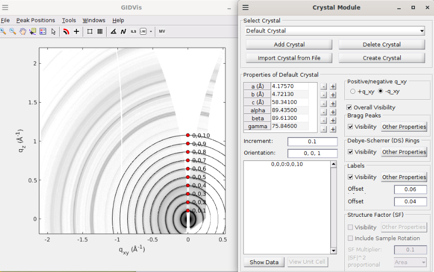

# Indexation

GIDVis provides a powerful tool for indexing the peaks of your crystal. However, peak indexation extends far beyond the scope of this tutorial, as it requires expertise in diffraction techniques and a solid understanding of the measured system.

To access the tool, navigate to `Peak Positions > Peak Indexation`. You can either import a crystal structure or define one manually. Once defined, you can plot diffraction peaks or Debye-Scherrer rings for a powder-like structure. For detailed instructions on handling peak display, refer to the GIDVis manual.

As an example, below is a Silver Behenate sample calibration, with indexed peaks corresponding to its lamellar organization.

