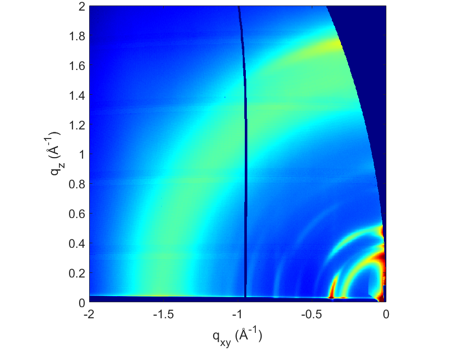
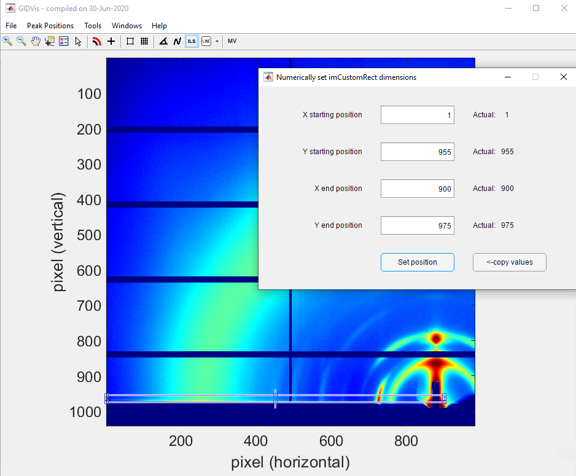
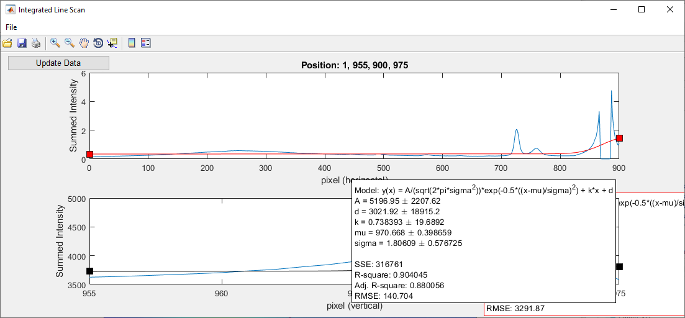
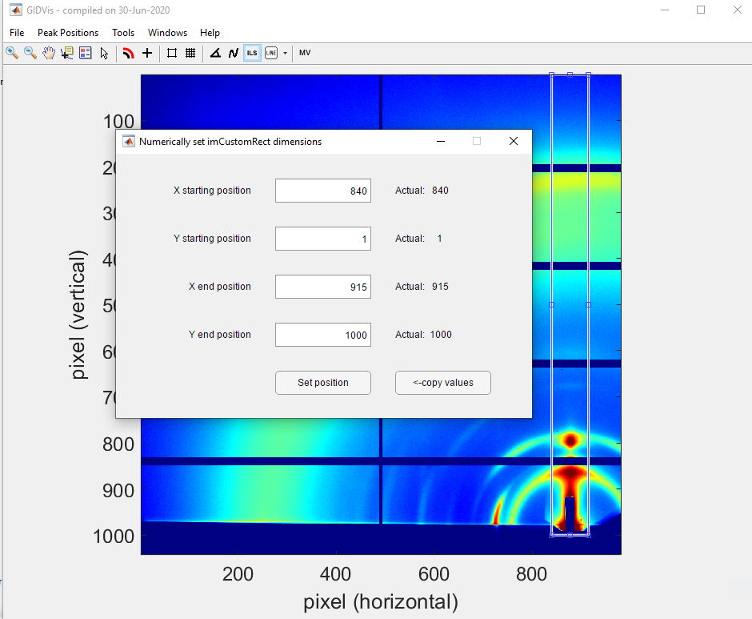
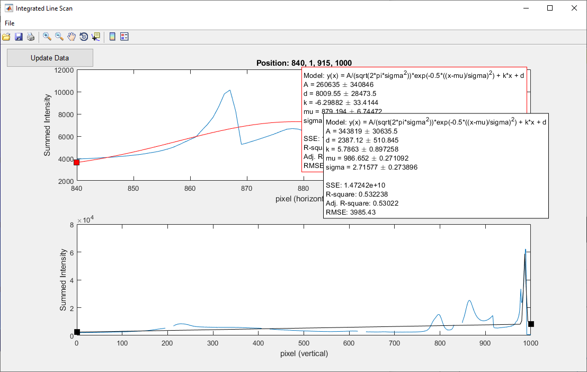

# In-plane and out-of-plane integration

## Warning: out-of-plane integration is often not rigorous

With a single angle of incidence, it is impossible to fully cover the range of $q_z$ at $q_{xy}=0$ due to the limitations of measuring the Ewald sphere with a planar 2D detector {cite:p}`steele2023`.



To rigorously obtain the out-of-plane region of reciprocal space at $q_{xy}=0$, techniques such as X-ray reflectivity should be used.

An approximation often made is to ignore the corrections required by the Ewald sphere. In this case, note that comparisons between in-plane and out-of-plane integrations can only be qualitative, particularly at high $q_z$ values.

We will see different approaches here to obtain in-plane and out-of-plane integrations.

## Integration directly in q-space

### In-plane
Performing in-plane integration directly in q-space is possible, since there is only little corrections related to the Ewald sphere.

1. **Initiate Integration**: Click on the `ILS` (Integrated Line Scan) icon.
2. **Draw the Integration Area**: Draw a rectangle to define the integration region. Typically, this rectangle is positioned just above the Yoneda-Vineyard peak, near the critical angle of total external reflection.
   - To adjust precisely, right-click the rectangle and select `Set position`.
   - Keep the rectangle's height consistent across samples for comparative purposes.
   - Ideally, report the integration domain in publications.


3. **Update Data**: In the `Integrated Line Scan` window, click on `Update Data` to process the selected rectangle.


4. **Export Data**: If needed, fit the peak positions using GIDVis or export the data for external analysis.
   - Go to `File > Export Line Data...`.
   - Select only `Sum vertically`, then click on `Export and Close`.

The exported text file contains intensity as a function of $q_{xy}$ in a two-column format. For this tutorial, the file was saved as `5151-5152-direct-integration-qxy.txt`.

### Out-of-plane
Due to the missing wedge, the out-of-plane integration directly in q-space is limited to small $q_z$ only. In our example, that would be up to $\sim 6$ $\rm{nm}^{-1}$.

1. **Initiate Integration**: Click on the `ILS` (Integrated Line Scan) icon.
2. **Draw the Integration Area**: Draw a rectangle to define the integration region. Typically, this rectangle is centered on the beamstop.
   - To adjust precisely, right-click the rectangle and select `Set position`.
   - Keep the rectangle's height consistent across samples for comparative purposes.
   - Ideally, report the integration domain in publications.


3. **Update Data**: In the `Integrated Line Scan` window, click on `Update Data` to process the selected rectangle.


4. **Export Data**: If needed, fit the peak positions using GIDVis or export the data for external analysis.
   - Go to `File > Export Line Data...`.
   - Select only `Sum horizontally`, then click on `Export and Close`.

The exported text file contains intensity as a function of $q_{z}$ in a two-column format. For this tutorial, the file was saved as `5151-5152-direct-integration-qz.txt`.


## In-plane and out-of-plane integrations from pixel-space

As noted earlier, in-plane and out-of-plane integrations are commonly performed without Ewald sphere corrections. However, this approximation must be explicitly mentioned in your publication {cite:p}`steele2023`.

1. **Select the TIFF File**: Use the original TIFF file, not the merged image (e.g., `SIRIUS_2024_11_22_5151_pilatus_sum.tiff`).
2. **Plot in Pixel Space**: Display the image in pixel space. If the plot appears empty, click on `Full` in the `Toolbox` window.
3. **Perform Integrations**: Follow the same steps as above for in-plane or out-of-plane integrations.

### In-plane
1. **Initiate Integration**: Click on the `ILS` (Integrated Line Scan) icon.
2. **Draw the Integration Area**: Draw a rectangle to define the integration region. Typically, this rectangle is positioned just above the Yoneda-Vineyard peak, near the critical angle of total external reflection.
   - To adjust precisely, right-click the rectangle and select `Set position`.
   - Keep the rectangle's height consistent across samples for comparative purposes.
   - Ideally, report the integration domain in publications.



3. **Update Data**: In the `Integrated Line Scan` window, click on `Update Data` to process the selected rectangle.



4. **Export Data**: If needed, fit the peak positions using GIDVis or export the data for external analysis.
   - Go to `File > Export Line Data...`.
   - Select only `Sum vertically`, then click on `Export and Close`.

The exported text file contains intensity as a function of the horizontal pixel number in a two-column format. For this tutorial, the file was saved as `5151-pixel-integration-horizontal.txt`.


### Out-of-plane
1. **Initiate Integration**: Click on the `ILS` (Integrated Line Scan) icon.
2. **Draw the Integration Area**: Draw a rectangle to define the integration region. Typically, this rectangle is centered on the beamstop.
   - To adjust precisely, right-click the rectangle and select `Set position`.
   - Keep the rectangle's width consistent across samples for comparative purposes.
   - Ideally, report the integration domain in publications.




3. **Update Data**: In the `Integrated Line Scan` window, click on `Update Data` to process the selected rectangle.



4. **Export Data**: If needed, fit the peak positions using GIDVis or export the data for external analysis.
   - Go to `File > Export Line Data...`.
   - Select only `Sum horizontally`, then click on `Export and Close`.

The exported text file contains intensity as a function of the vertical pixel number in a two-column format. For this tutorial, the file was saved as `5151-pixel-integration-vertical.txt`.

5. **Deal with the dead zones**: Notice that a peak is missing around pixel 830 due to a dead zone in the detector. The same procedure should then be repeated with the exact same rectangle for the other detector angle, in this case using the file `SIRIUS_2024_11_22_5152_pilatus_sum.tiff`.

For this tutorial, the resulting file was saved as `5152-pixel-integration-vertical.txt`.

### Conversion to q-space

Now, you need to convert the pixel-space profiles to q-space using the following approximated formulas, not taking into account the corrections due to the Ewald sphere.

#### **$q_{xy}$**

$$q_{xy} = \frac{4\pi}{\lambda} \sin\left(\frac{2\theta}{2}\right),$$

where, for each pixel with horizontal coordinate $x$, the angle $2\theta$ is given by:

$$2\theta = \tan^{-1}\left(\rm{pixel\_size} \cdot \frac{x - \rm{pos\_direct\_x}}{D}\right).$$

Here, $\rm{pos\_direct\_x}$ represents the position of the direct beam on the rotated detector, and is calculated as:

$$\rm{pos\_direct\_x} = \rm{PONI}_x - \frac{D}{\rm{pixel\_size}} \cdot \tan(\delta),$$

where $\delta$ is the in-plane angle of the detector, and $D$ is the distance between the detector and the sample.

#### **$q_{z}$**

$$q_{z} = \frac{2\pi}{\lambda} \left(\sin(\alpha_f) + \sin(\alpha_i)\right),$$

where $\alpha_f$ is calculated for each pixel with vertical coordinate $y$ using the formula:

$$\alpha_f = \tan^{-1}\left(\frac{\rm{pixel\_size} \cdot (\rm{pos\_direct\_y} - y)}{D}\right) - \alpha_i,$$

and $\rm{pos\_direct\_y}$ is the position of the direct beam on the rotated detector, calculated as:

$$\rm{pos\_direct\_y} = \rm{PONI}_y + \frac{D}{\rm{pixel\_size}} \cdot \tan(\gamma),$$

where $\gamma$ is the out-of-plane angle of the detector, and $D$ is the distance between the detector and the sample.

###
```python

test

```
