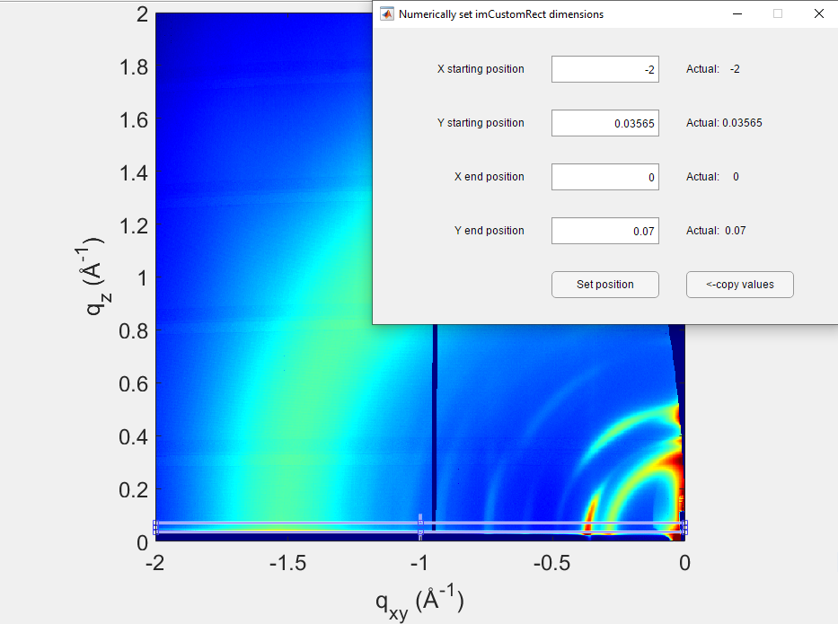
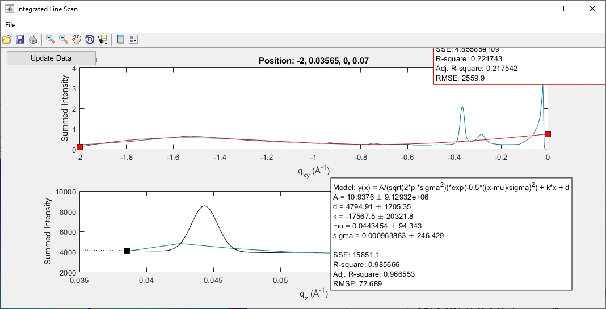
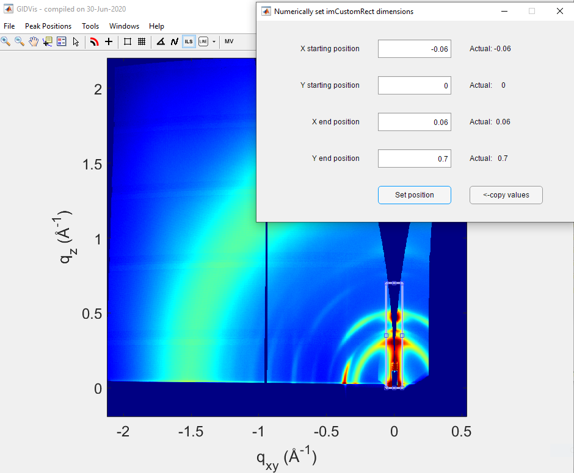
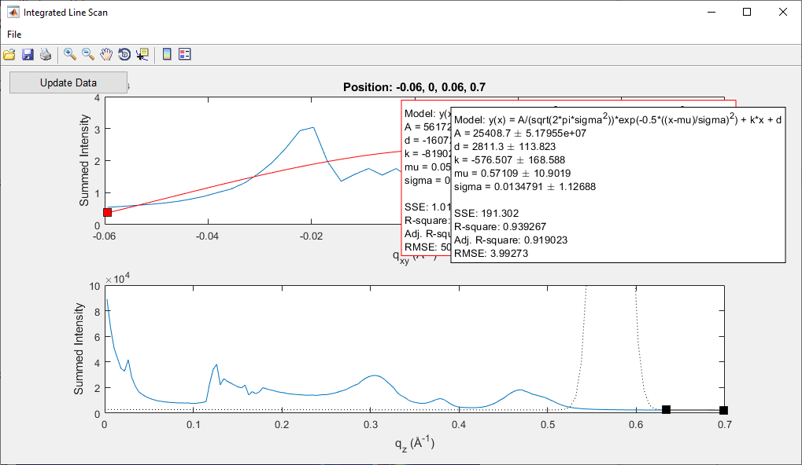

# In-plane and out-of-plane integration

## Warning: out-of-plane integration is often not rigorous

With a single angle of incidence, it is impossible to fully cover the range of $q_z$ at $q_{xy}=0$ due to the limitations of measuring the Ewald sphere with a planar 2D detector {cite:p}`steele2023`.

To rigorously obtain the out-of-plane region of reciprocal space at $q_{xy}=0$, techniques such as X-ray reflectivity should be used.

An approximation often made is to ignore the corrections required by the Ewald sphere, and integrate on $q_x$ vs. $q_z$ maps. In this case, note that comparisons between in-plane and out-of-plane integrations are mostly qualitative, particularly at high $q_z$ values.

We will see different approaches here to obtain in-plane and out-of-plane integrations.

## Integration directly in q-space

### In-plane
Performing in-plane integration directly in q-space is possible, since there is only little corrections related to the Ewald sphere.

1. **Initiate Integration**: Click on the `ILS` (Integrated Line Scan) icon.
2. **Draw the Integration Area**: Draw a rectangle to define the integration region. Typically, this rectangle is positioned just above the Yoneda-Vineyard peak, near the critical angle of total external reflection.
   - To adjust precisely, right-click the rectangle and select `Set position`.
   - Keep the rectangle's height consistent across samples for comparative purposes.
   - Ideally, report the integration domain in publications.

3. **Update Data**: In the `Integrated Line Scan` window, click on `Update Data` to process the selected rectangle.

4. **Export Data**: If needed, fit the peak positions using GIDVis or export the data for external analysis.
   - Go to `File > Export Line Data...`.
   - Select only `Sum vertically`, then click on `Export and Close`.

The exported text file contains intensity as a function of $q_{xy}$ in a two-column format. For this tutorial, the file was saved as `5151-5152-direct-integration-qxy.txt`.

### Out-of-plane
Due to the missing wedge, the out-of-plane integration directly in q-space is limited to small $q_z$ only. In our example, that would be up to $\sim 6$ $\rm{nm}^{-1}$.

1. **Initiate Integration**: Click on the `ILS` (Integrated Line Scan) icon.
2. **Draw the Integration Area**: Draw a rectangle to define the integration region. Typically, this rectangle is centered on the beamstop.
   - To adjust precisely, right-click the rectangle and select `Set position`.
   - Keep the rectangle's height consistent across samples for comparative purposes.
   - Ideally, report the integration domain in publications.

3. **Update Data**: In the `Integrated Line Scan` window, click on `Update Data` to process the selected rectangle.

4. **Export Data**: If needed, fit the peak positions using GIDVis or export the data for external analysis.
   - Go to `File > Export Line Data...`.
   - Select only `Sum horizontally`, then click on `Export and Close`.

The exported text file contains intensity as a function of $q_{z}$ in a two-column format. For this tutorial, the file was saved as `5151-5152-direct-integration-qz.txt`.

## In-plane and out-of-plane integrations in $q_x$ vs. $q_z$ space

As mentioned earlier, out-of-plane integrations are often performed in the $q_x$ vs. $q_z$ space without applying Ewald sphere corrections. However, GIDVis does not support this type of integration.

We recommend using an alternative solution, such as the pyFAI package, for this purpose. Interested readers can refer to [this section](https://arnaudhemmerle.github.io/data-analysis-on-sirius/chapters/giwaxs/pyfai/about.html) of the tutorial to learn more about pyFAI and how to perform these integrations.
