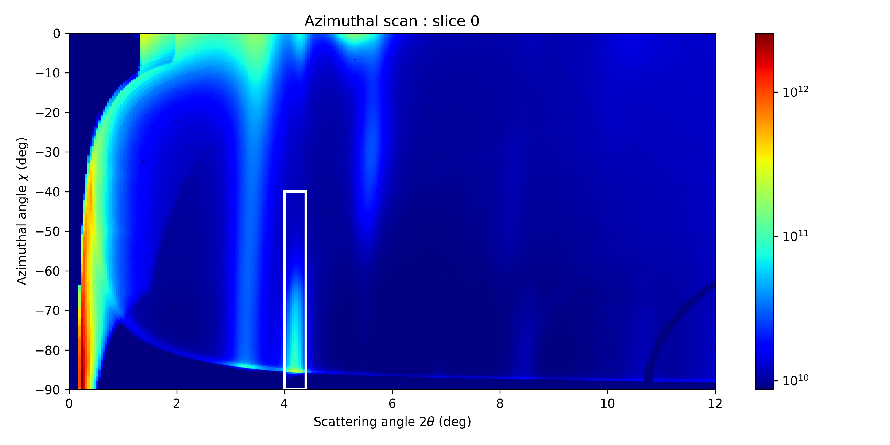
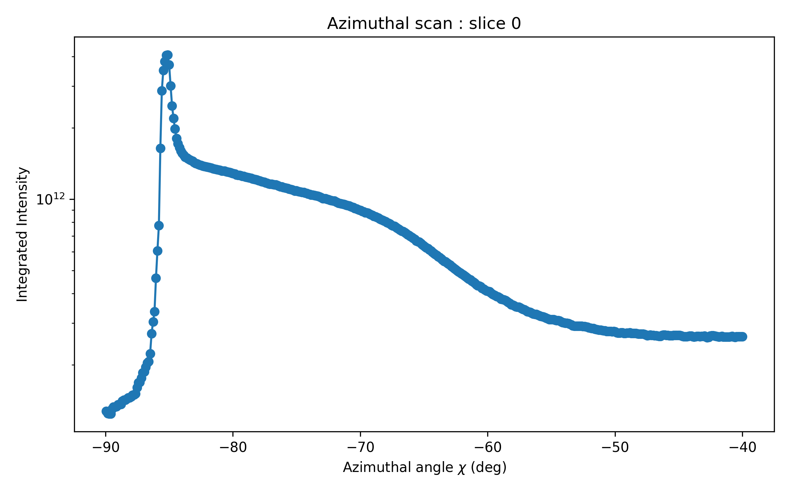

# Azimuthal scan

## Azimuthal vs 2$\theta$ map

In this step, we will extract the **azimuthal scan**, which is useful for analyzing texturing effects. First, we generate the azimuthal vs. 2$\theta$ map, where we will define the integration region for the scan.

You can adjust the **maximum 2$\theta$ value** to be displayed in the image, then run the cell.

```python
# Modify only the maximum 2_theta you want to reach in the image, and run the cell
max_tth = 12 #in-plane, in deg

...

```

Running the cell will generate the map.


## Azimuthal scan

Now, we need to define the integration region on the 2D map to obtain the intensity vs. azimuthal angle ($\chi$) plot.

You can adjust the integration boundaries (represented by the borders of the white rectangle) and then run the cell.

```python
# Modify only the limits for the integration, and run the cell.

# Define the left and right boundaries for selection (modify these values)
left_tth = 4.    # Set your desired left boundary (in degrees)
right_tth = 4.4  # Set your desired right boundary (in degrees)
# Define the top and bottom chi boundaries
bottom_chi = -90   # Bottom boundary (in degrees)
top_chi = -40      # Top boundary (in degrees)

...
```



