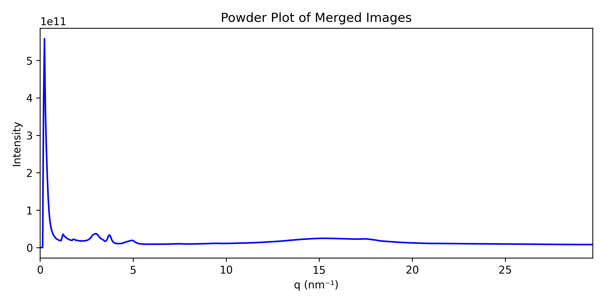
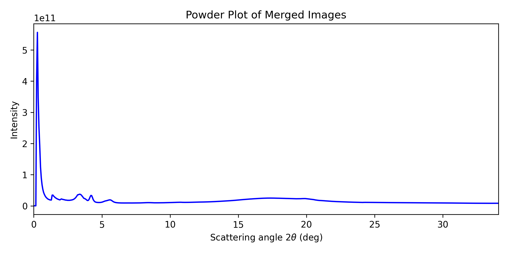

# Powder plot

A powder plot represents the intensity as a function of the q vector, defined as $q=\sqrt{q_{xy}^2+q_z^2}$. This allows for comparison with powder diffractograms obtained from other sources.

You can adjust the **number of data points** in the powder plot (which directly affects its resolution), then run the cell.

```python
# Modify only the number of data points you want in the powder plots, and run the cell
npt_powder_plot = 600

...

```

Running the cell will generate the powder plot in q-space as well as in 2$\theta$.

Additionally, `dat` files containing the corresponding data for further analysis will be generated.




