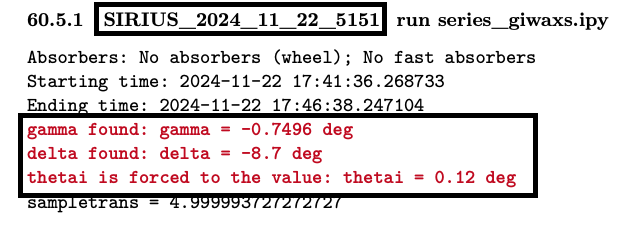
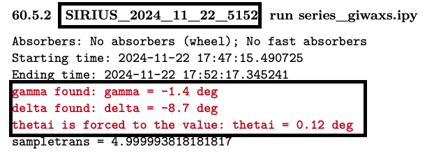
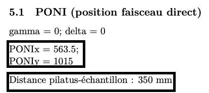
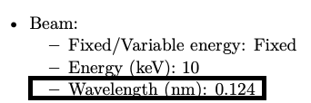

# Beam parameters

In this section, we'll review the various parameters that need to be configured to work in q-space. **To adapt the notebook to your own experiment, we assume that you've collected all the necessary information from your beamline scientist (wavelength, PONI, sample-detector distance, etc.). However, you can also find these details in the PDF electronic notebook.**

The first cell contains all the beam parameters. Run it.

```python
# Modify with the beam parameters

wavelength = 1.24 # in Angstrom
sample_detector_distance = 350 # in mm
PONIx = 563.5 # in pixel
PONIy = 1015 # in pixel
delta = -8.7 # in deg
incident_angle = 0.12 # in deg

# Out-of-plane angle for each image
gamma_A = -0.75 # in deg
gamma_B = -1.4 # in deg

# Modify with the path to your images
# img_A measured at gamma_A
path_A = "raw_data/SIRIUS_2024_11_22_5151_pilatus_sum.tiff"
# img_B measured at gamma_B
path_B = "raw_data/SIRIUS_2024_11_22_5152_pilatus_sum.tiff"
```

Additional information on specific parameters:
- **PONIx/PONIy**: The position of the direct beam on the detector, sometimes called PONIx and PONIy (Point Of Normal Incidence). Check the info relevant to your own experiment in the PDF electronic notebook.
- **delta**: In-plane angle of the detector, in degrees.
- **incident_angle**: The incident angle on the sample, in degrees. It is written in the PDF notebook as ```thetai```.
- **gamma_A/gamma_B**: The two out-of-plane angles of the detector, in degrees, corresponding here to scans ```5151``` at $\gamma=-0.75$ and ```5152``` at $\gamma=-1.4$.

All this information can be found in the PDF electronic notebook:





## Special case of a single GIWAXS image
This tutorial is based on a GIWAXS measurement with two detector positions, which helps eliminate the horizontal dead zones of the detector. If your experiment includes **only one GIWAXS image per sample**, you can duplicate the same values for `gamma_A` and `gamma_B`, and use the same image for both `path_A` and `path_B`.

Your modified first cell would look like this:

```python
# Modify with the beam parameters

wavelength = 1.24 # in Angstrom
sample_detector_distance = 350 # in mm
PONIx = 563.5 # in pixel
PONIy = 1015 # in pixel
delta = -8.7 # in deg
incident_angle = 0.12 # in deg

# Out-of-plane angle for each image
gamma_A = -0.75 # in deg
gamma_B = -0.75 # in deg

# Modify with the path to your images
# img_A measured at gamma_A
path_A = "raw_data/SIRIUS_2024_11_22_5151_pilatus_sum.tiff"
# img_B measured at gamma_B
path_B = "raw_data/SIRIUS_2024_11_22_5151_pilatus_sum.tiff"
```


