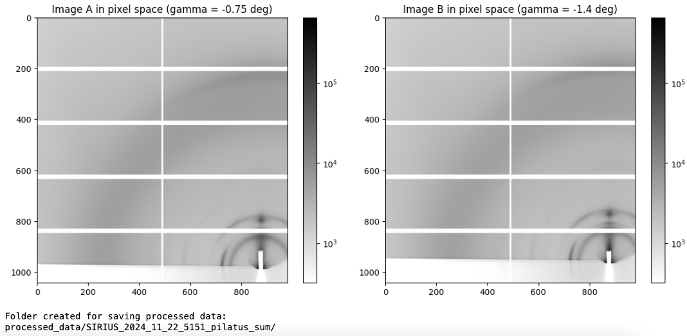
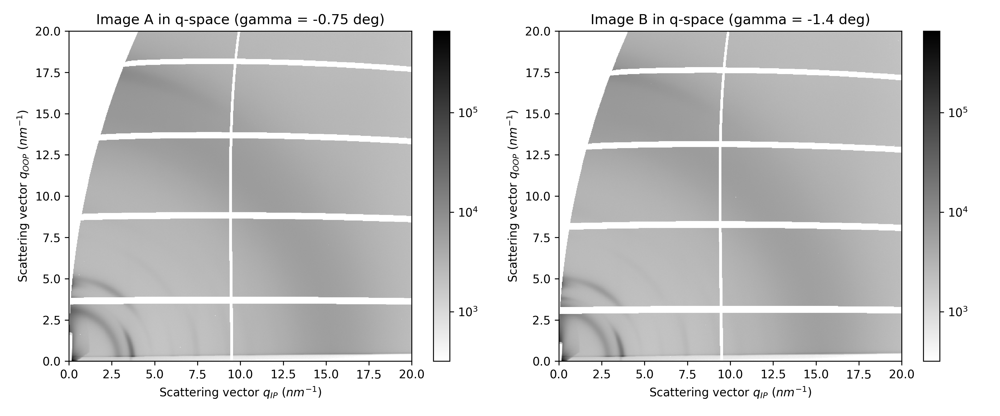

# Load images & convert to q-space

## Load images

Run the next cell as is. You may want to adjust the image contrast by modifying the `vmin` value.

```python
# Run this cell as is

# Load images
img_A = fabio.open(path_A).data
img_B = fabio.open(path_B).data

# You may want to adjust the contrast of the image with vmin and vmax
vmin = np.nanpercentile(img_A,10)
vmax = np.nanmax(img_A)

...

```



This will create a folder to store all further results, with its name based on the first image’s filename.

The two displayed images, in pixels, correspond to measurements taken at each detector angle. Each image is actually the sum of all images acquired during the scan.

## Conversion to q-space
The next step is to convert from pixel space to q-space.

Modify the maximum in-plane and out-of-plane q you want to reach in the image, and run the cell.

```python
# Modify only the maximum q you want to reach in the images, and run the cell
max_qip = 20 #in-plane, in 1/nm
max_qoop = 20 #out-of-plane, in 1/nm

...
```


