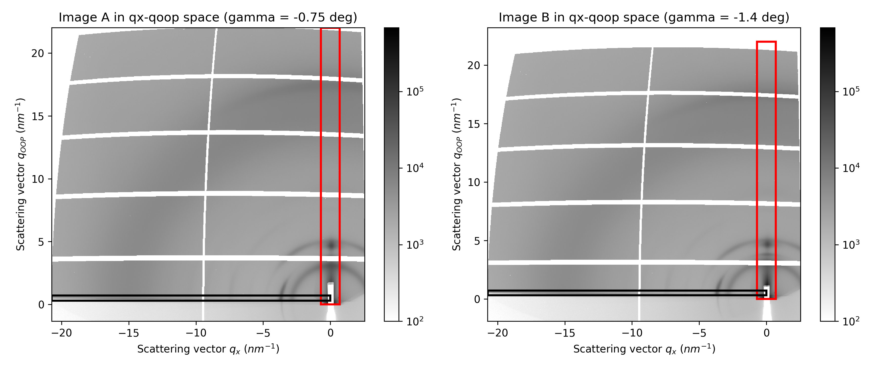
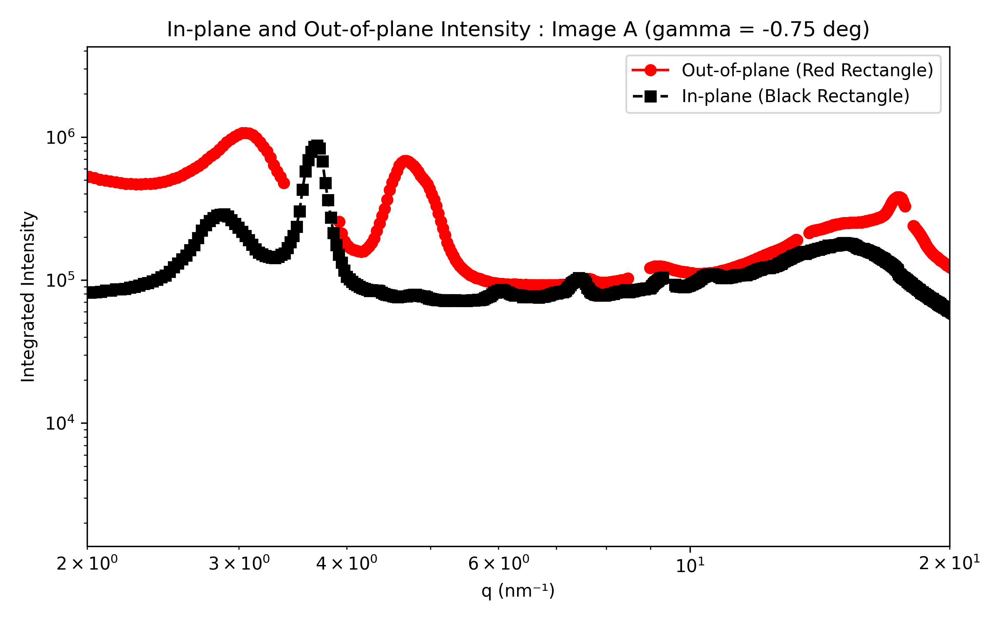
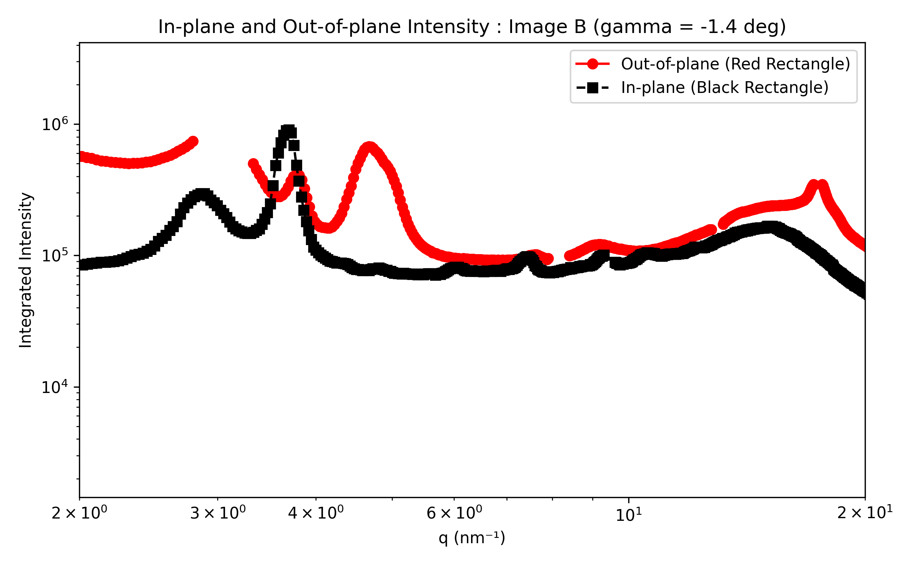
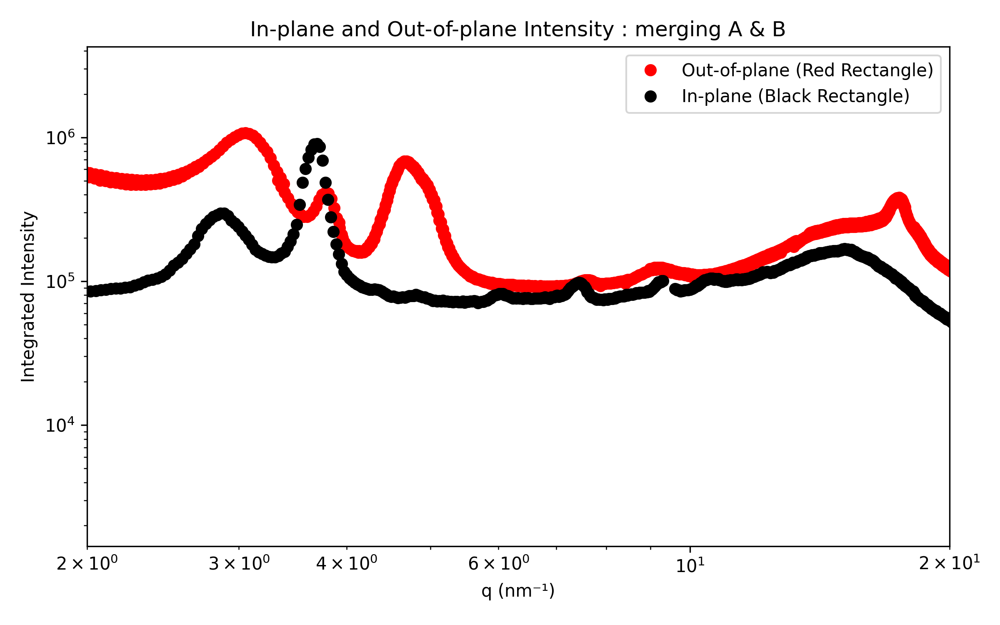

# In-plane & out-of-plane integration

## Warning: out-of-plane integration is often not rigorous

With a single angle of incidence, it is impossible to fully cover the range of $q_z$ at $q_{xy}=0$ due to the limitations of measuring the Ewald sphere with a planar 2D detector {cite:p}`steele2023`.

To rigorously obtain the out-of-plane region of reciprocal space at $q_{xy}=0$, other techniques such as X-ray reflectivity should be used.

An approximation often made is to ignore the corrections required by the Ewald sphere, and integrate on $q_x$ vs. $q_z$ maps. In this case, note that comparisons between in-plane and out-of-plane integrations are mostly qualitative, particularly at high $q_z$ values.


## Definition of the integration area
The **in-plane integration** will be performed within the **black rectangle**, while the **out-of-plane integration** will be performed within the **red rectangle**. Define the boundaries in the cell below and run it.

```python
# Define the left and right boundaries for the in-plane integration
# -> Red rectangle
left_qx = -0.7    # Set your desired left boundary (in nm^-1)
right_qx = 0.7  # Set your desired right boundary (in nm^-1)

# Define the bottom and top boundaries for the out-of-plane integration
# -> Black rectangle
bottom_qoop = 0.3   # Bottom boundary (in nm^-1)
top_qoop = 0.7      # Top boundary (in nm^-1)

...

```



## Performing the integration
Once you are satisfied with the boundaries, adjust the **limits of the final plot** in the next cell and run it.

```python
# Define the limits of the plot and run the cell
q_min = 2
q_max = 20

...

```

The in-plane and out-of-plane intensity profiles will be generated for each image individually. In the final plots, the two out-of-plane datasets will be combined to remove gaps caused by dead zones.

In your further analysis, you can choose whether to:
- keep both datasets separate,
- merge them, using the second image to fill the missing data.






## Save parameters

Finally, run the last cell to generate a text file with all the parameters saved.
