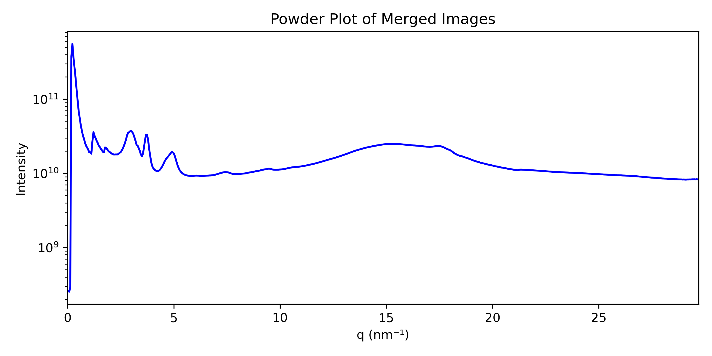
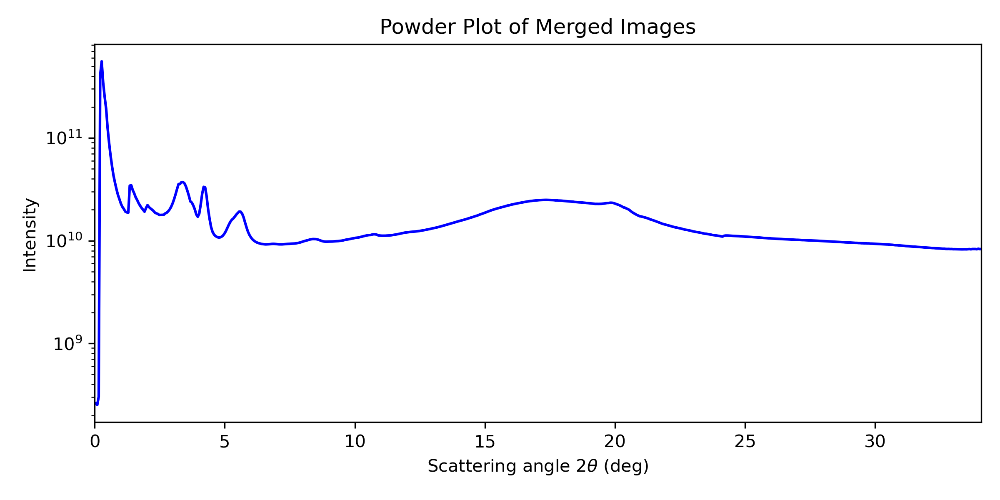
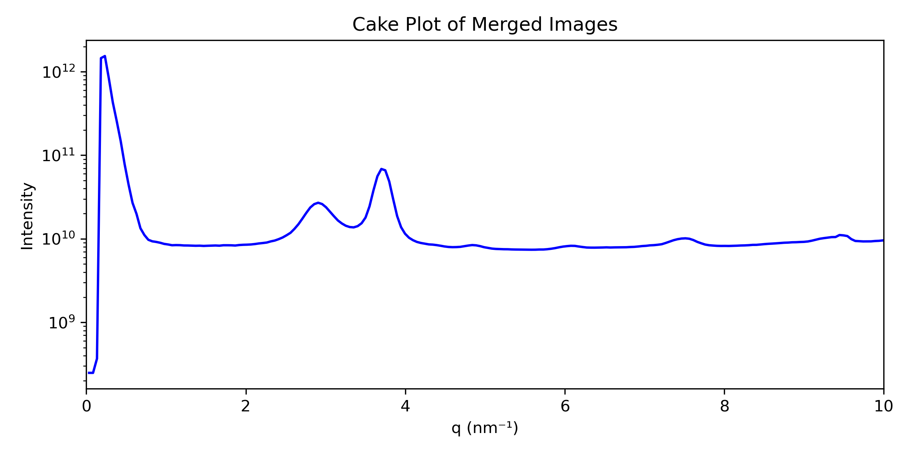

# Powder & cake plot

A powder plot represents the intensity as a function of the q vector, defined as $q=\sqrt{q_{xy}^2+q_z^2}$. This allows for comparison with powder diffractograms obtained from other sources.

You can adjust the **number of data points** in the powder plot (which directly affects its resolution), then run the cell.

```python
# Modify only the number of data points you want in the powder plots, and run the cell
npt_powder_plot = 600

...

```

Running the cell will generate the powder plot in q-space as well as in 2$\theta$.

Additionally, `dat` files containing the corresponding data for further analysis will be generated.





It is sometimes more interesting to focus only on a wedge for the integration, and not on the whole image. This integration is often called a "cake" or "sector" plot.

You can adjust the **number of data points**, the **azimuthal range**, the **maximal q range** on which you wish to integrate, and then run the cell.

```python
# Modify only the number of data points you want in the cake plots,
# the azimuth range, the radius in q, and run the cell
npt_cake_plot = 600
azimuth_range = (-180,-160) # in deg
q_radius = 10 # in nm-1

...

```



