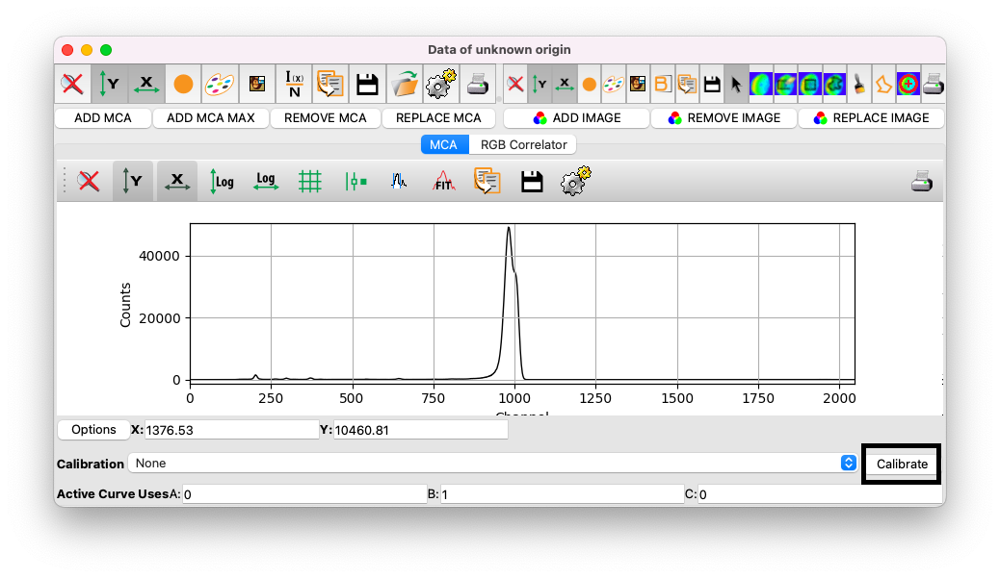
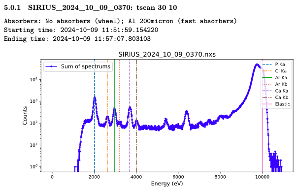
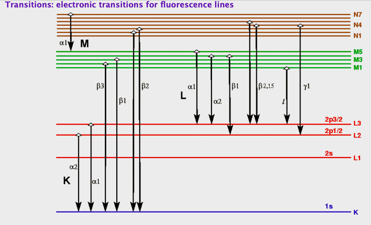
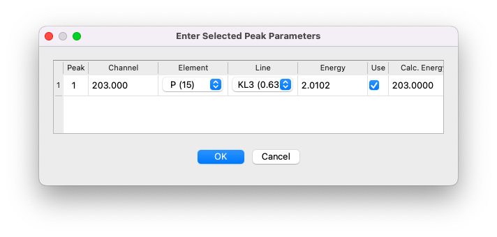
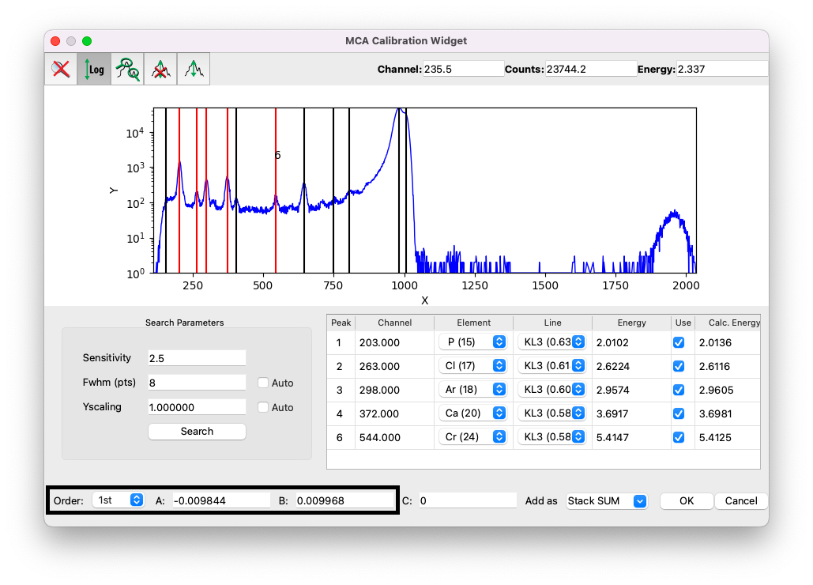
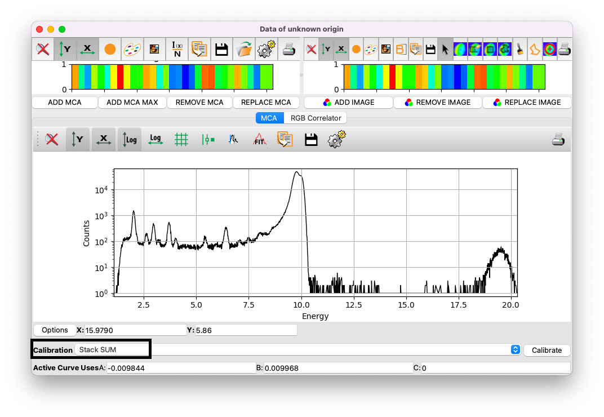

# Energy calibration

The first step in analyzing XRF data is to calibrate the relationship between the detector channels and energy (in keV). PyMca provides a second-order calibration formula:

$$E{\rm[keV]} = A + B \times {\rm channel} + C \times {\rm channel}^2.$$

However, a linear calibration ($C=0$) is preferred. For SIRIUS data, the calibration is typically close to $B = 0.0099$ - $0.01$, meaning each channel corresponds to approximately 9.9–10 eV.

Click on the `Calibrate` button to start the process.

If you already have calibration values, you can click `Edit` and manually input them (ensure values are in keV). For this tutorial, we will demonstrate how to determine these values directly.

## Calibrate with known peaks

Calibration requires data with well-defined peaks of known elements. Keep in mind that calibration may drift during beamtime and, if it is the case, require adjustment. Here, we'll perform the calibration directly using the scan to be analyzed.

1. After clicking `Calibrate`, select `Compute`.
2. Leave the parameters unchanged and click `Search`.

PyMca will identify potential peaks for calibration. It may detect Rayleigh and Compton peaks near the incident beam energy, but these should not be used for calibration due to potential inaccuracies. Only elemental peaks should be selected, avoiding non-elemental artifacts such as sum or escape peaks {cite:p}`sole2007,beckhoff2006`.

To identify peak energies, refer to the notebook used during beamtime:

Alternatively:
- Use the `Tools > Identify Peaks` option in PyMca's main window (you will need to exit the calibration interface first).
- Refer to external resources like [Hephaestus](https://bruceravel.github.io/demeter/) or peak energy tables.

### Example calibration

For example, if a peak appears at channel 203 and is identified as phosphorus (P), assign it to the K$\rm \alpha1$ line (K-L3 transition). Refer to charts like this one from Hephaestus to match lines with transitions:

1. Select the peak, choose the element (P), and assign the line (K$\rm \alpha1$).
2. Click `OK`.

Repeat this process for other peaks, such as:
- Chlorine (Cl) K$\rm \alpha1$
- Argon (Ar) K$\rm \alpha1$
- Calcium (Ca) K$\rm \alpha1$
- Chromium (Cr) K$\rm \alpha1$ (not from the sample, but from metalic pieces in the beam path).

### Finalizing calibration

1. Set the interpolation order to `1st` for linear calibration.
2. Record the coefficients $A$ and $B$. For this example, the calibration equation is:

   $$E{\rm[keV]} = -0.009844 + 0.009968 \times {\rm channel}.$$

3. Verify calibration by comparing the `Energy` and `Calc. Energy` columns in the table.

Once satisfied, click `OK`. The calibration will be stored under the default name `Stack SUM`.

Finally, select the calibration `Stack SUM`, and the spectrum will be displayed with energy on the x-axis.

