# Fit the spectrum

One of the main features of PyMca is its ability to accurately fit the spectrum to extract the area of each group of peaks corresponding to the elements present in the sample.

The results obtained from fitting can be useful for:
- **Identification** of the elements present in the sample,
- **Relative comparison** of the concentration of the same element between samples,
- **Tracking changes** in the concentration of an element over time.

**Note:** Relative comparisons of the concentrations of different elements within a sample, or absolute quantification of concentrations, may also be possible. However, achieving accurate results for these purposes requires prior discussions with the beamline staff before the experiment. Proper calibrations and a more precise definition of each parameter are necessary.

Attempting quantification without these preparatory steps is done at your own risk and may lead to unreliable results, primarily due to the energy-dependent attenuation of the X-ray fluorescence signal.

## Start the fitting module

Ensure that the spectrum you wish to analyze is displayed in the window, then click on `Fit/Advanced`.

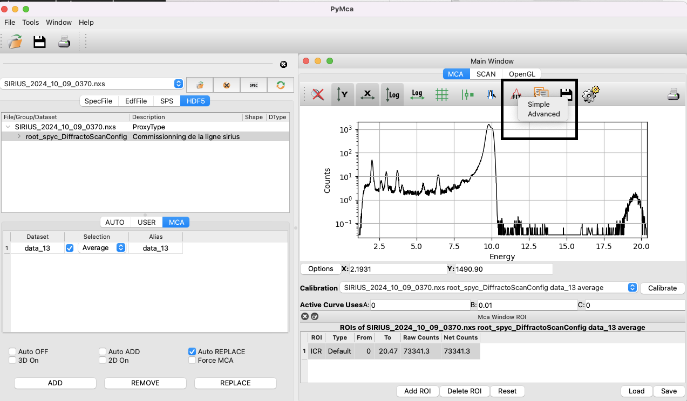

A window will open, notifying you that no peaks are selected. Click on `OK`. Verify that the displayed spectrum is the correct one.

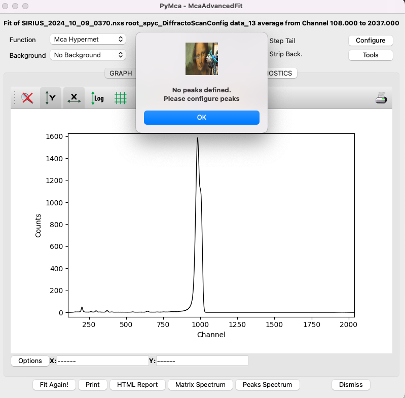

## Import a configuration file

Several parameters need to be set before fitting the data. It is strongly recommended to start with a pre-defined configuration file, such as the one corresponding to the scan in this tutorial, available [here](../../../_static/xrf/pymca/config_xrf_1elem_start.cfg) (right-click, then `Save the link as`).

To load the configuration file in PyMca, click on `Configure`, then `Load`, and import the appropriate file. Next, review the parameters that need to be adapted for the present experiment, following this guide.

## Setup the fit region

In the `MCA Fit Parameters` window, which you can access by clicking on `Configure`, set the range of channels relevant to your spectrum. Start by setting the first channel to zero and the last channel to correspond to the energy of the incident beam. Recall the approximate factor of 10 between energy in eV and channels. For example, with an incident beam energy of 10 keV, this corresponds to channel 1000.

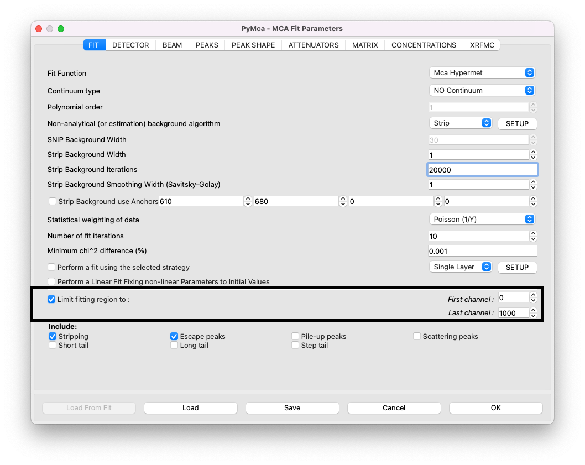

Click `OK`. Back in the display window, you can click on `E` to switch from channels to energy and on `Log` to display a logarithmic y-scale. If part of the curve is missing along the y-axis, click twice on the auto-scale button (the second button) to adjust the y-axis. The same applies to the x-axis.

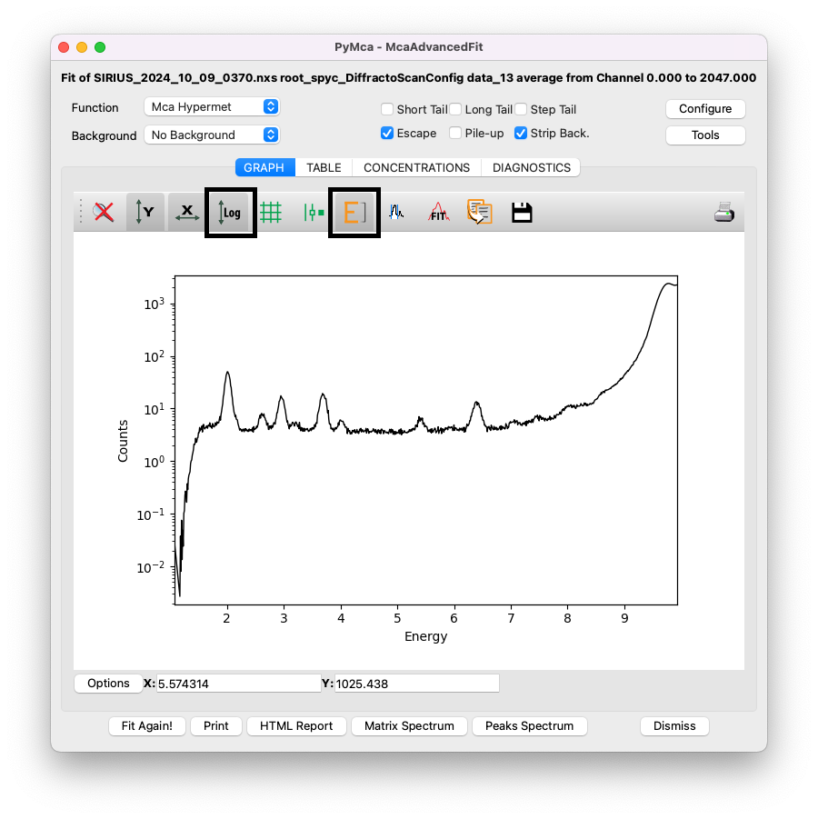

For PyMca to work, the fitting region must be slightly adjusted. On the low-energy side, exclude the sharp decrease in intensity, here below channel 160. On the high-energy side, cut the fit before the scattering peaks (Rayleigh and Compton peaks), as they are poorly described by PyMca's fitting algorithm. For instance, here the upper limit is set at channel 770.

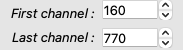

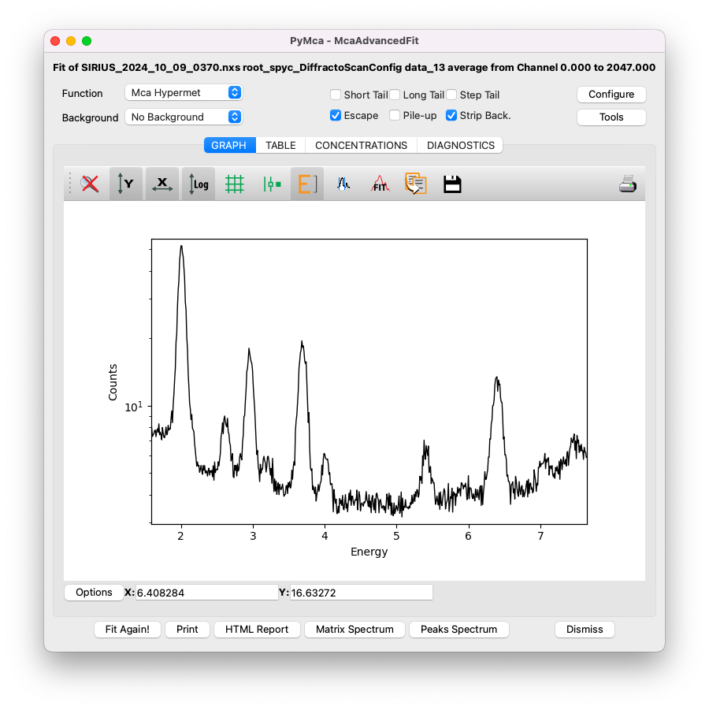

## Setup the energy of the x-ray beam

In the `MCA Fit Parameters` window, click on the `BEAM` tab and set the incident beam energy in keV.

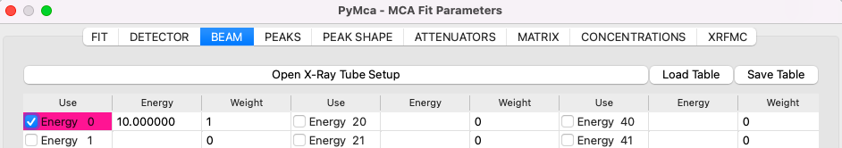

## Setup the attenuators

In the `MCA Fit Parameters` window, go to the `ATTENUATORS` tab. The media traversed by the emitted X-ray fluorescence must be accurately described to account for energy-dependent attenuation. For most experiments performed with the Langmuir trough, the XRF detector is positioned above the layer in a backscattering geometry. In this configuration, the fluorescence passes through the following media:
1. A layer of helium, which has negligible attenuation and is not accounted for here.
2. A Kapton window, 25 microns thick.
3. A layer of air, typically 4 cm. Note: in this tutorial's experiment, the detector was positioned as close as possible to the Kapton window, leaving only 5 mm of air. Adapt to your experimental configuration.
4. A Beryllium window in the detector, approximately 8 microns thick.

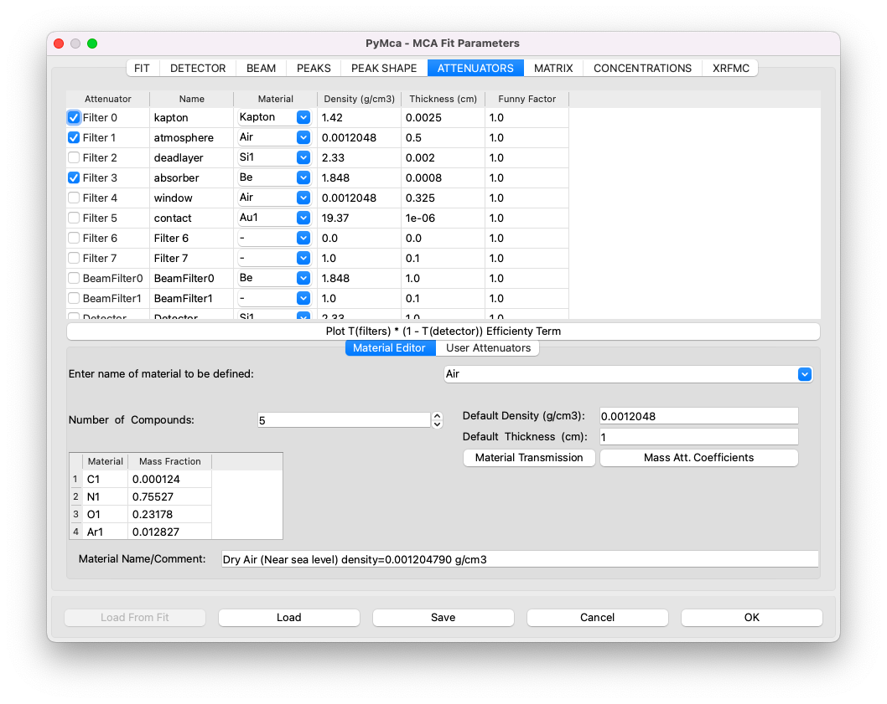

## Attribute the peaks to correct elements

Next, identify the different elements present in your sample. To do this, close the `MCA Fit Parameters` window by clicking on `OK`, and click on a peak in the spectrum. This action should open the `Peak Identifier` tool, which helps you determine the element associated with each peak. For example, clicking on the first peak might indicate that it corresponds to Phosphorus. Repeat this process for each peak, and write down the list of elements present in your sample.

Note that Argon (Ar) is commonly detected due to the residual air in the trough and in front of the detector. It is also common to observe elements such as Nickel (Ni), Copper (Cu), Titanium (Ti), and Iron (Fe) due to metallic parts of the beamline illuminated by the X-ray beam.

Once you have the list of elements, return to the `MCA Fit Parameters` window and navigate to the `PEAKS` tab. Click on each identified element and select the appropriate emission line group. For instance, for Phosphorus (P), you would include the `K` group, which automatically adds the `Ka` and `Kb` emission lines.

A helpful feature is that if you have the periodic table and the display window open simultaneously, green lines will indicate the expected positions of the peaks.

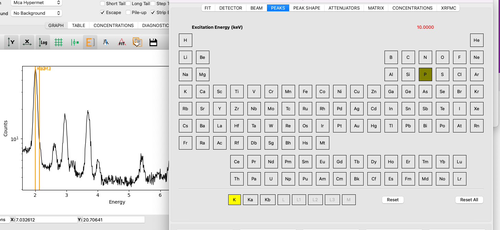

It is unnecessary to select individual lines such as `Ka` and `Kb` separately unless you want to fit them independently. However, this is not recommended, as there is no physical reason to justify fitting these lines separately; their intensity ratio is governed by physical laws.

The following elements have been identified in this tutorial file (all using `K` lines only):

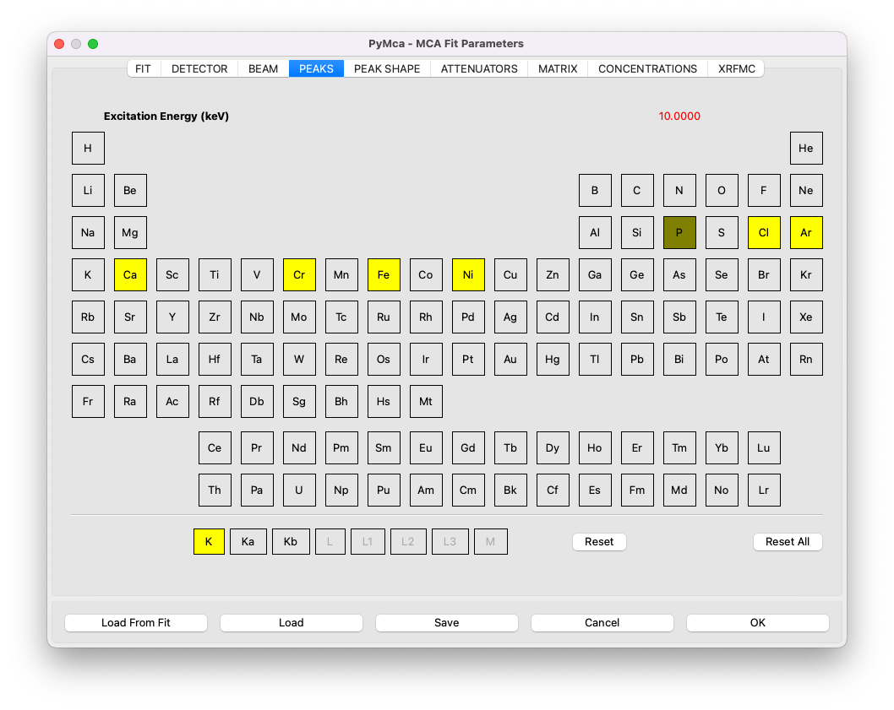

## Perform the fit

Save the configuration file by clicking on `Save` in the `MCA Fit Parameters` window, then click `OK`. Next, click on `Fit` in the `McaAdvancedFit` window. To adjust the y-scale after fitting, click twice on the `Y` button.

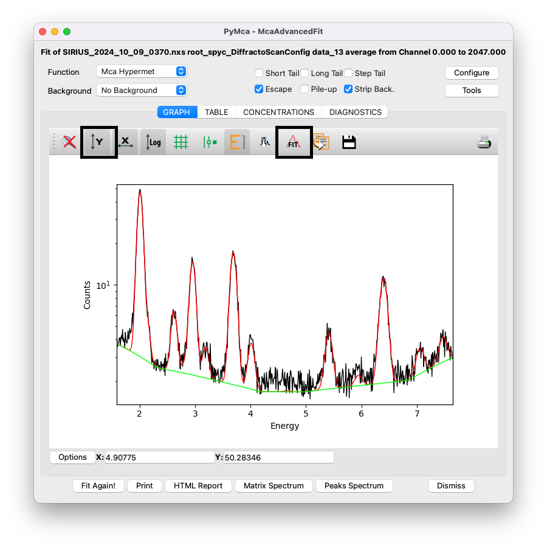

The red curve represents the fitting curve, while the green curve shows the *stripped* background used by PyMca.

## Extract the results

Navigate to the `TABLE` tab to view the area associated with each element and its uncertainty (sigma). These values can be used for the analysis described at the beginning of this section. To copy the table, right-click on it and select the appropriate option.

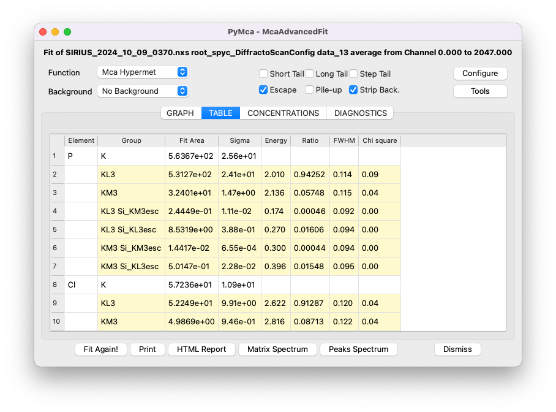

For a more detailed summary of the fit, click on the `HTML Report` button to generate a comprehensive report.

If you’ve missed any steps, you can download the configuration file filled with the appropriate values [here](../../../_static/xrf/pymca/config_xrf_1elem_finish.cfg) (right-click, then `Save the link as`).
