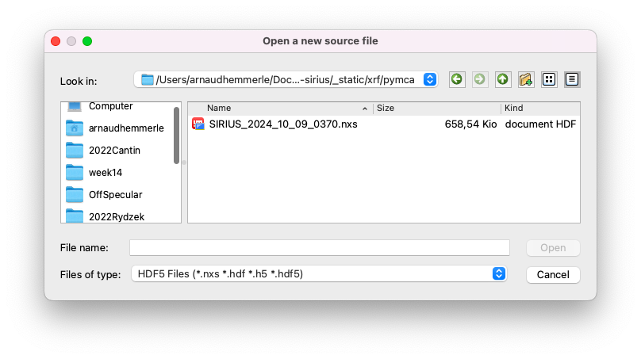
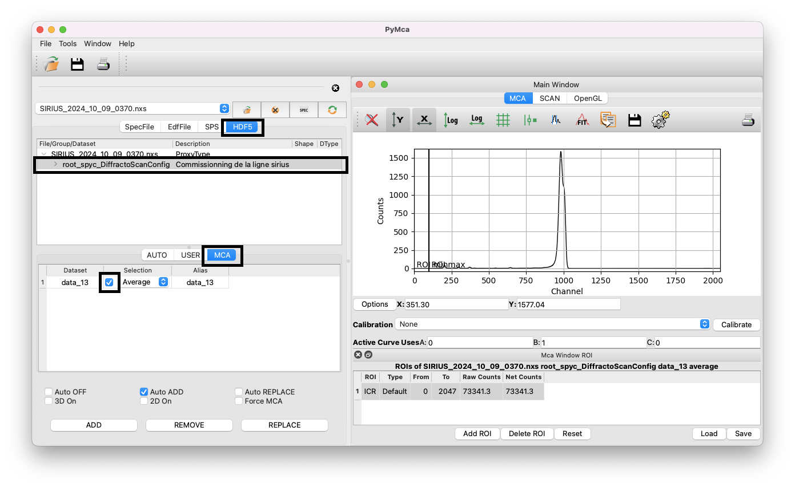
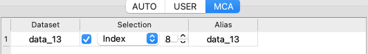
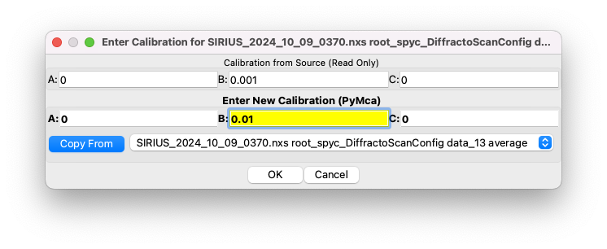
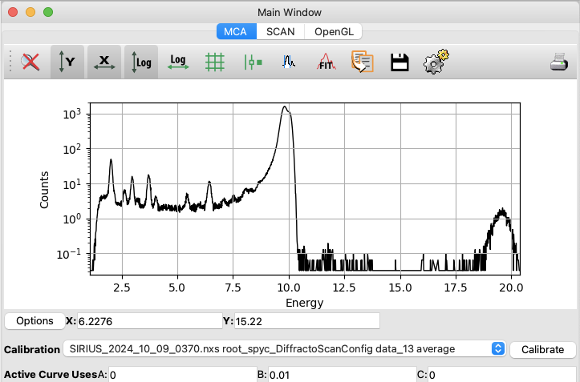

# Import & visualize data

In this section, we will explore how to import and visualize XRF data collected on the SIRIUS beamline.

Example data can be downloaded [here](../../../_static/xrf/pymca/SIRIUS_2024_10_09_0370.nxs). The dataset corresponds to a monolayer of the phospholipid DPPS (1,2-Dipalmitoyl-sn-glycero-3-phosphoserine, 16:0/16:0 PS) at the helium-water interface, with an area-per-molecule of 0.38 nm$^2$ (surface pressure of 40 mN/m). The incident X-ray beam has an energy of 10 keV.

The file is in Nexus format (HDF5), which contains 31 individual XRF spectra acquired with the single-element detector, each integrated over 10 seconds, along with associated metadata and data measured on other sensors. Fortunately, PyMca can directly handle such Nexus files.

## Open the file

1. Navigate to `File > Open > Data Source`.
2. Select the `.nxs` file and ensure that the file type is set to `HDF5 Files`.

## Import the spectrum

After opening the file:

1. Ensure that the `HDF5` tab is active.
2. Click on the first item in the list named `root_spyc_DiffractoScanConfig`.
3. Go to the `MCA` tab.
4. Select the averaged spectrum and tick the box to choose the dataset.

You should now see the average of the 31 XRF spectra acquired during the scan in the right window. The data are displayed as the intensity of each detector channel. You can explore the curve by zooming in on certain regions, changing the y-scale to log, etc. If you have multiple files open, you can also use the `ADD/REMOVE/REPLACE` buttons to compare spectra.

If you work with data evolving with time (for example, following a kinetics), you can select a specific index instead of averaging over the whole scan.

## Optional: display data in keV instead of channels

The x-axis is natively displayed in channels. A rigorous calibration is needed to convert the x-axis from detector channels to energy units, but for simple visualization, we can use the approximate relation that energy in eV is 10 times the channel index.

To convert the x-axis to approximate energies:
1. Click on `Calibrate/Edit`.
2. Set `B` to 0.01 (PyMca uses keV).
3. Validate and select the correct calibration from the list.

## Specific case of the 4-elements detector

Following the same procedure but using data from the 4-elements detector, you will see four datasets, each corresponding to one element. You can compare them and select the dataset you wish to analyze. Unfortunately, there is no native option to average the spectra from the different elements to improve the statistics.
