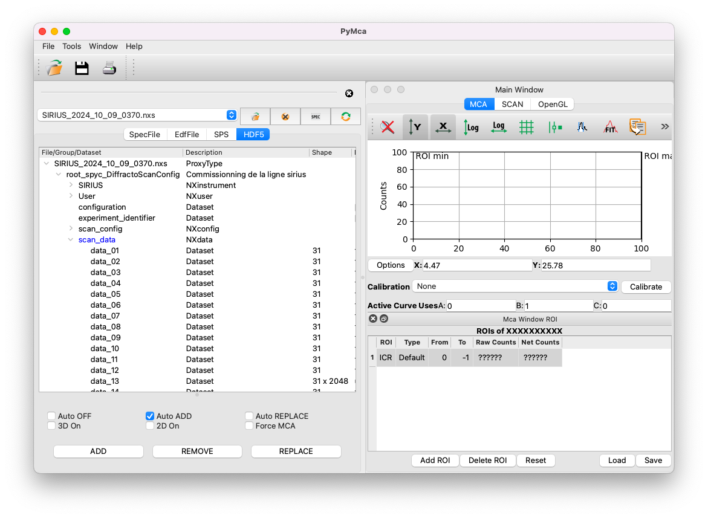
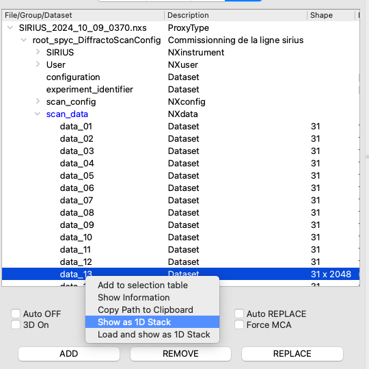
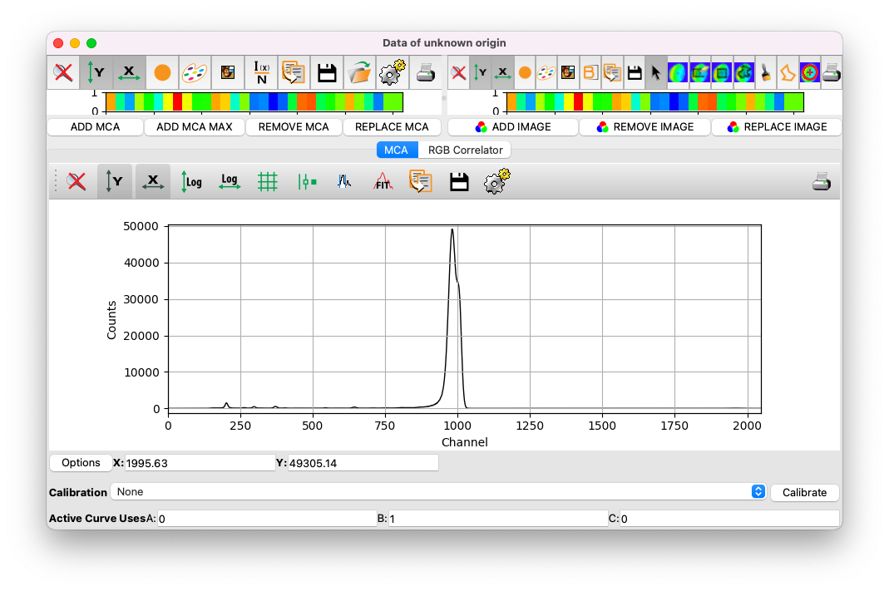

# Import data

In this section, we will explore how to import XRF data collected on the SIRIUS beamline. This tutorial focuses on data acquired using the single-element SDD detector. For details on data from the four-element SDD detector, refer to [this section](content:four-elements-sdd).

Example data can be downloaded [here](../../../_static/xrf/pymca/SIRIUS_2024_10_09_0370.nxs). The dataset corresponds to a monolayer of the phospholipid DPPS (1,2-Dipalmitoyl-sn-glycero-3-phosphoserine, 16:0/16:0 PS) at the helium-water interface, with an area-per-molecule of 0.38 nm$^2$ (surface pressure of 40 mN/m).

The file is in Nexus format (HDF5), which contains 31 individual XRF spectra, each integrated over 10 seconds, along with associated metadata and data measured on other sensors. Fortunately, PyMca can directly handle such Nexus files.

## Open the file

1. Navigate to `File > Open > Data Source`.
2. Select the `.nxs` file and ensure that the file type is set to `HDF5 Files`.

## Import the summed spectrum

After opening the file, you will see its structure displayed in the **HDF5** tab.

To import the XRF data:

1. Expand the file structure by clicking on the arrows until you locate the `scan_data` group (highlighted in blue).
2. Look for the dataset with the shape `Nx2048`, where `N` represents the number of spectra in the scan. In this example, select `data_13`.
3. Right-click on `data_13` and select `Show as 1D Stack`.
4. A window prompts you to reshape the data. Click `Dismiss`.

You will now see the sum of the 31 XRF spectra acquired during the scan. The data are displayed as the intensity of each detector channel. Calibration will be needed to convert the x-axis from detector channels to energy units.

