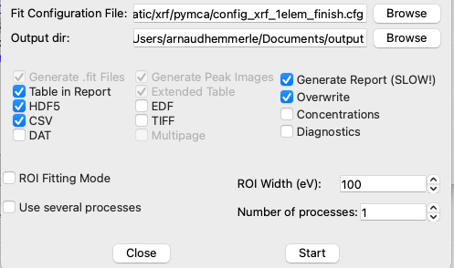
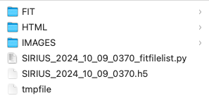
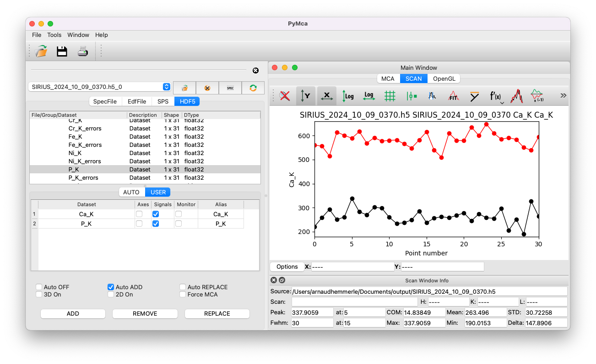

# Batch fitting for kinetics analysis

After fitting a single spectrum and saving the configuration file, you can perform batch fitting on a series of data. This is especially useful for studying kinetics, such as the evolution of a specific ion's concentration near an air-water interface.

For demonstration purposes, we will use the same training data as in the previous sections. This data was recorded over 310 seconds, during which no significant evolution is expected due to the short timescale.

## Set up the batch fitting

1. Open the main PyMca window and click on `Tools/Batch fitting`.
2. Click `Browse` and select the Nexus file.
3. Expand the entry `root_spyc_DiffractoScanConfig`, then expand the entry named `scan_data`.
   - This will display all the datasets recorded in the file.
   - Identify the dataset containing the XRF spectra by examining their shape. XRF spectra datasets typically have a shape of Nx2048, where N is the number of spectra collected.
   - Double-click on the appropriate dataset and tick the box for `Signals`.
   - Click `Done`.

**Note:** When using the 4-element detector, you can select multiple elements as signals. PyMca will sum the spectra of the selected elements and perform the fit on the combined data.

4. Select the configuration file and specify an output directory for saving the results.
5. Check the boxes for the desired result formats:

If the fitting process is slow or crashes, consider deselecting the option to generate reports to simplify the output.

6. Click `Start` to begin the batch fitting process. Note that it may take a few seconds to initialize.

## Files generated by the batch fitting

Various files will be generated by the fitting process:

### Folder FIT

This folder contains text files with details for each of the N fits performed, including parameters and curves.

### Folder HTML

This folder includes the file `index.html`, which allows you to review each individual fit with the results displayed as a table. **Note:** Generating the HTML slows down the fit process and may require significant storage space.

### Folder IMAGES

This folder contains:
- The configuration file used for your fit.
- A key file: a CSV file with all the results (e.g., the area of each peak group as a function of the spectrum index). This CSV file can be directly opened with tools like Excel or Origin.

### FILENAME.h5

A HDF5 file is also generated. It contains the same results as the CSV file but can be directly opened with PyMca (similar to how you would open a Nexus file).

