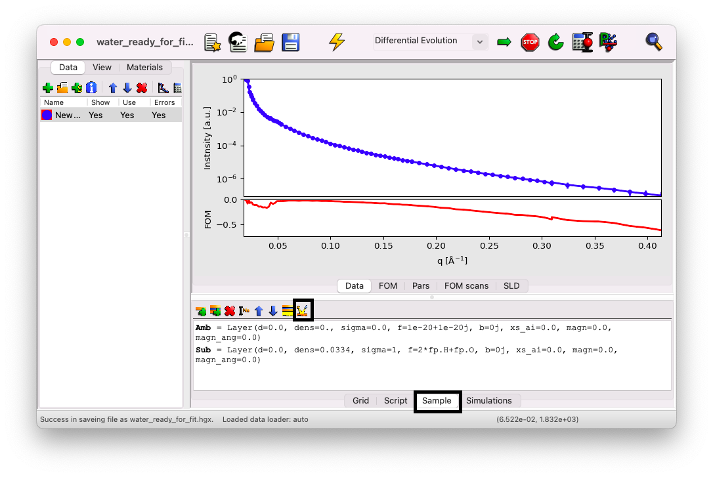

# Beam parameters

We will continue with the `.hgx` file downloaded in the previous section. This file already contains the correct parameters to describe the beamline, but we will review them here so that you can later modify them to match your own beamtime. In most cases, the only parameter you'll need to adjust is the wavelength.

First, click on the `Sample` tab, then on the icon on the far right labeled `Edit instruments`.

This opens the editor window:

Notice the `Help` button, which provides useful extra information about each parameter.

## Radiation & x-coordinates

Configure the following parameters:

- **probe**: `x-ray`
- **wavelength**: Obtain the value (in ångströms) from the electronic notebook. If only the energy is available, use this formula: $\lambda (\text{Å}) = 12.398/E (\text{keV})$
- **I0**: $1$
- **Ibkg**: $0$
- **pol**: `uu`
- **coords**: `q`
- **tthoff**: $0$
- **incangle**: $0.5$

## X-resolution & footprint

Accounting for experimental resolution and footprint effects is beyond the scope of this tutorial. In most cases, you can achieve satisfactory results without considering these effects. The resolution is only significant if your data show numerous well-defined oscillations, and the footprint effect becomes relevant if your sample is smaller than the projected beam footprint near the critical angle. For most XRR experiments at liquid-gas interfaces, these parameters are not necessary, but they may be important for solid samples. If needed, consult beamline staff or relevant literature for additional details {cite:p}`daillant2009a, vignaud2019`.

For this tutorial, configure the parameters as follows:
- **restype**: `no conv`
- **footype**: `no corr`

Leave all other parameters unchanged.

## Notice the constant fit parameters

You may notice that both **I0** and **Ibkg** are displayed in a different color. If you click on the `F` button located next to them, you'll see that they are defined as `Constant fit parameters`. This designation means that these parameters will appear prominently in the front view later and can be easily adjusted. We will revisit this point in a future section.

