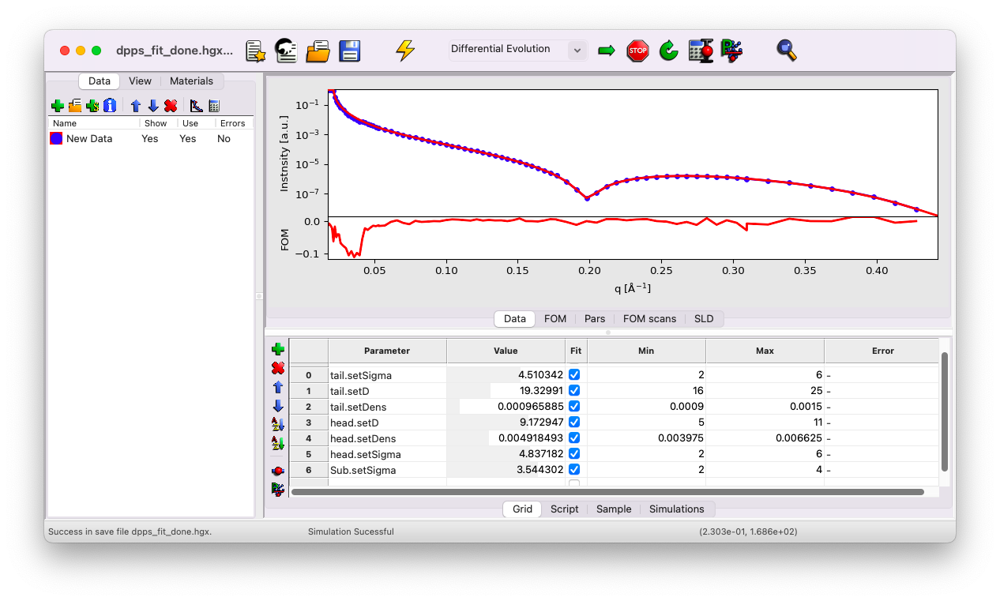

(content:build-model)=
# Build a more complex model

Now we will proceed with a more complex system than a simple liquid-gas interface. We will build the model step-by-step and estimate the initial guesses for the various parameters.

The data correspond to a monolayer of the phospholipid DPPS (1,2-Dipalmitoyl-sn-glycero-3-phosphoserine, 16:0/16:0 PS), at the helium-water interface, at an area-per-molecule of 0.38 nm$^2$ (surface pressure of 40 mN/m). The data file can be downloaded [here](../../../_static/xrr/genx/SIRIUS_2024_09_20_4556-4640_XRR.dat) (right-click>Save link as). We will start with a simple GenX file where the data have already been imported, available [here](../../../_static/xrr/genx/dpps_init.hgx).

## Model the lipid

The signal measured in XRR is dictated by electron density **contrast** between the different layers. As such, it would be incorrect to model the lipid as a single block, as the aliphatic chains and the PS head exhibit a strong density contrast. Therefore, we will model our system with the following layers, from top to bottom:
- a semi-infinite medium of Helium (considered as vacuum),
- a layer for the aliphatic tails,
- a layer for the PS heads,
- a semi-infinite sub-phase of water.

## Fill the sample parameters

Go to the `Sample` tab, click on `Sub`, and then on the icon `Insert a Stack`.

Give it the name `dpps`. Now, within this stack, insert a first layer for the tails. Click on the stack `dpps`, then on the icon `Insert a Layer`.

### Tail layer

Name this first layer `tail`. We will estimate the initial value of each parameter as follows.

#### *Thickness $d$*

A good starting point for the thickness of the tail layer is the theoretical length of an elongated aliphatic chain with $n$ carbons in all-trans conformation, given by {cite:p}`israelachvili2011, tanford1980`:

$$
L_{\rm max}[{\rm nm}] = 0.126n + 0.146
$$

or, considering gauche defects:

$$
L_{\rm max}[{\rm nm}] = 0.095n + 0.146.
$$

In this case, we have 16 C per chain, yielding $L_{\rm max} = 22$ $\rm A$. We can set the initial guess to $d = 22$ $\rm A$ and designate `d` as a fitting parameter.

#### *Formula $f$*

In our model, the chains are composed of 35 C, 67 H, and 4 O atoms. The formula to input in the `f` box is `35*fp.C+67*fp.H+4*fp.O`. Do not set `f` as a fitting parameter.

#### *Density $\rm dens$*

We can use the area per molecule from the Langmuir trough ${\cal A} = 38$ ${\rm A}^2$ and the estimated layer thickness $d = 22$ $\rm A$ to calculate the density. Since we consider two chains per molecule, the density in GenX units is:

$$
{\rm dens} = \frac{1}{{\cal A} \cdot L} = \frac{1}{38 \times 22} = 0.0012.
$$

Set `dens` as a fitting parameter.

#### *Roughness $\rm sigma$*

A good initial guess for the roughness is the value obtained for water, i.e., ${\rm sigma} = 3$ $\rm A$. Set `sigma` as a fitting parameter.

### Head layer

Add a second layer, name it `head`, and **check the position of the layer in the stack**. The order should be from top to bottom: helium, tail, head, water. If the layer is not correctly positioned, select it and use the arrow icons to move it up or down.

#### *Thickness $d$*

Looking at the chemical drawing of our molecule, we can estimate the thickness to be around 5 $\rm A$. Set $d = 5$ $\rm A$ and designate `d` as a fitting parameter.

#### *Formula $f$*

In our model, the heads are composed of 3 C, 6 H, 6 O, 1 P, 1 Na, and 1 N atoms. The formula to input in the `f` box is: `3*fp.C+6*fp.H+6*fp.O+1*fp.P+1*fp.Na+1*fp.N`. Do not set `f` as a fitting parameter.

#### *Density $\rm dens$*

Use the same approach as before to calculate the density:

$$
{\rm dens} = \frac{1}{{\cal A} \cdot L} = \frac{1}{38 \times 5} = 0.0053.
$$

Set `dens` as a fitting parameter.

#### *Roughness $\rm sigma$*

As before, set ${\rm sigma} = 3$ $\rm A$. Set `sigma` as a fitting parameter.

### Sub-phase

You need to set the roughness of the water sub-phase to $3$ $\rm A$, and set it as a fitting parameter.

Your sample tab should look like this:

If you've missed any steps, you can download the updated file [here](../../../_static/xrr/genx/dpps_ready_for_fit.hgx).

## Playing with the parameters

Go to the `Grid` tab. You'll notice that all the parameters that were defined as fitting parameters are listed here. First, simulate the curves with your initial guesses.

You can see that the first dip in your model appears at a slightly larger q vector compared to the data. This typically suggests that the thickness of a layer is underestimated. The initial guess is close enough to the data to obtain a reasonable fit, but we will refine it further as an exercise.

We know that we are already near the maximum possible length for the chains. Thus, the thickness to adjust is likely that of the head layer. The initial guess of $5$ $\rm A$ is a bit low, as indicated by measurements from a simple molecular model using the software [Avogadro](https://avogadro.cc/), which suggests a thickness of approximately $8$ $\rm A$:

Try setting the head thickness to $d=7$ $\rm A$ instead of $5$. This yields a slightly better fit. Use this opportunity to experiment with all the individual parameters to observe their effects on the curve.

Notice that the new value is outside the default min/max range. GenX applies a constrained min/max range by default. Adjust these ranges to reasonable values as follows:
- $\sigma_{\rm tail}$ and $\sigma_{\rm head}$ between $2$ and $6$ $\rm A$,
- $\sigma_{\rm water}$ between $2$ and $4$ $\rm A$,
- $d_{\rm tail}$ between $16$ and $25$ $\rm A$,
- $d_{\rm head}$ between $5$ and $11$ $\rm A$.

For now, keep the density values unchanged.

(content:build-model:fit)=
## Start the fit

Start the fit by clicking the Arrow icon in the top bar. After some time, you'll notice that the parameters stop evolving. Click the Stop icon and keep the fit results. Simulate the results once to confirm that the current set of parameters corresponds to the best-fit values. You should now see that the model matches the data perfectly.

**Be careful**, this does not necessarily mean that you have solved the structure of your sample. You have found one set of parameters that fit the data, but there is no guarantee that another set of parameters would not fit the curve equally well (an inherent limitation of XRR).

Finally, click on the calculator icon to estimate the error for each parameter.

If you've missed any steps, you can download the updated file [here](../../../_static/xrr/genx/dpps_fit_done.hgx).
