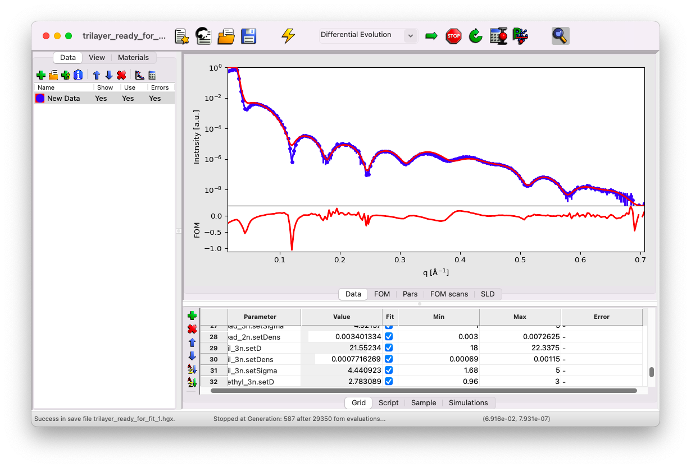
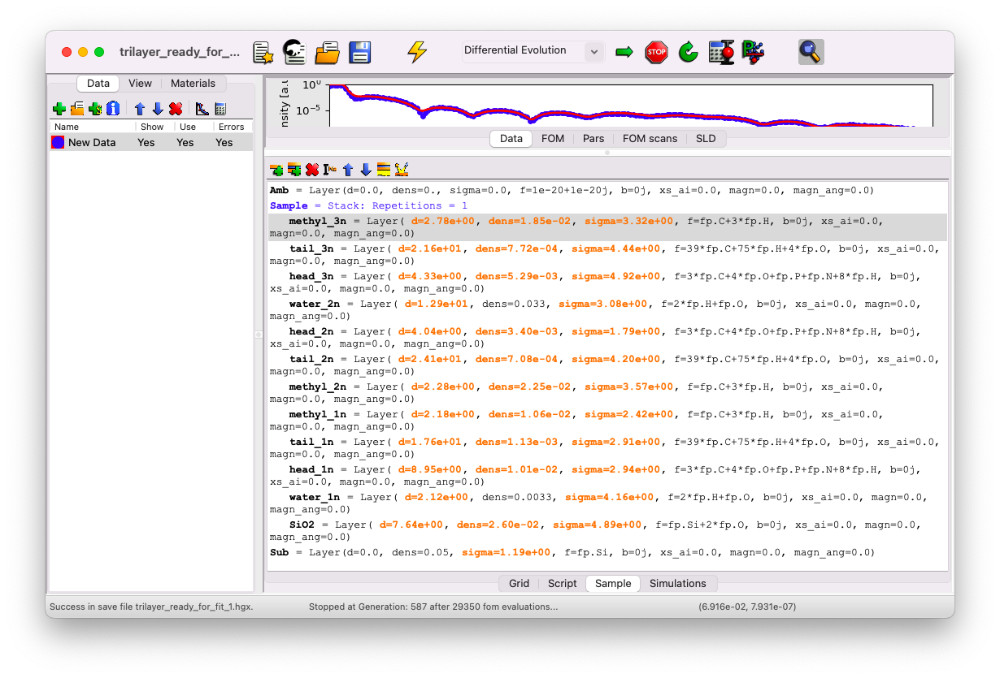

(content:genx-examples)=
# Other examples & resources

## Trilayer on a solid substrate

Here is an example to show that complex systems can be fitted as well. It is a trilayer of the phospholipid DSPC deposited on a Si substrate using the Langmuir-Blodgett method. After some work, particularly in finding an initial guess—which requires experience and a review of the literature—it is possible to achieve a good fit.

The model consists of 14 layers and 34 fit parameters in total.

The file can be found [here](../../../_static/xrr/genx/trilayer_fit_done.hgx) and used as a starting point for similar systems.

## Resources

Below is a list of files included in this tutorial that may serve as starting points for your own analysis:

- A GenX file with a fit of a **DPPS monolayer** at the gas-water interface: [Download here](../../../_static/xrr/genx/dpps_fit_done.hgx).
- A GenX file with a fit of a **trilayer of DSPC** deposited on a Si substrate: [Download here](../../../_static/xrr/genx/trilayer_fit_done.hgx).
- A GenX file with a fit of a **helium-water interface**: [Download here](../../../_static/xrr/genx/water_fit_done.hgx).
- A GenX file with a fit starting from an **unknown model**: [Download here](../../../_static/xrr/genx/unknown_two_layers_fit_done.hgx).
