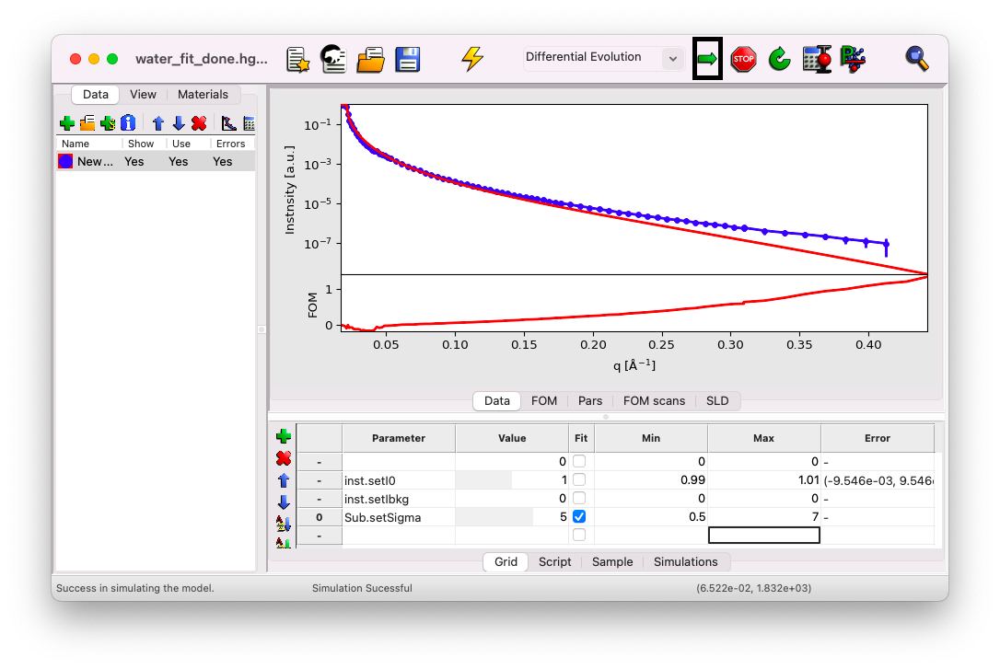

# Fit the Data

Click on the tab `Grid` to see the active parameters.

You'll notice three parameters present in the view:
- **I0** and **Ibkg**, which we previously defined as `Constant fit parameters`,
- and **sigma** of the sub-phase (`Sub.setSigma`), which was defined as a `Fit parameter`.

Each parameter has its value, which can be edited by clicking in the box, a minimum and maximum range for the fit (the value must lie within this range), and a column for estimating the error bar of each fitted parameter, which will update after the fit.

## Simulate the Data

First, click on the thunder symbol to simulate the data. We will attempt to adjust the only fit parameter we have, `sigma`, to better match the data at large q vectors. Set `sigma` to $5$ and simulate the curve. The box changes color because the value is outside the min/max range. While simulations are still possible, you cannot perform a fit until the range is adjusted.

You’ll notice that the model (the red curve) is now too low compared to the data (the blue dots) at large q vectors. The true value for `sigma` should therefore lie between $1$ and $5$ $\rm A$.

## Fit the Data

Adjust the min/max range to between $0.5$ and $7$ $\rm A$. Then, click on the arrow to start the fit.

The value of `sigma` will update in real-time, and after a few seconds, the process will stop and ask if you want to keep the fit. Click "Yes." The best-fit value for `sigma` should be close to $3$ $\rm A$, a typical value for the roughness induced by capillary waves at the air-water interface at room temperature {cite:p}`braslau1988`. Simulate the results after the fit to visualize the best-fit curve.

Once the fit is complete, click the calculator icon in the top bar to estimate the error on your fit parameter.

Here, the result is $\sigma = 3.16$ $\rm A$, with an asymmetric error bar: $\sigma_{inf} = 3.16 - 0.08 = 3.08$ $\rm A$ and $\sigma_{sup} = 3.16 + 0.04 = 3.2$ $\rm A$.

## SLD

In the `SLD` tab, you can view the Scattering Length Density profile (essentially the Electron Density Profile in this case). This curve models the electron density profile resulting from the best fit. You'll notice the value of $\rho_{el} = 0.334$ $\rm{e}^{-}/\rm{A}^3$ for water at negative $z$, $\rho_{el} = 0$ $\rm{e}^{-}/\rm{A}^3$ for the helium part at positive $z$, and the smooth transition at the interface characterized by the parameter `sigma`.
