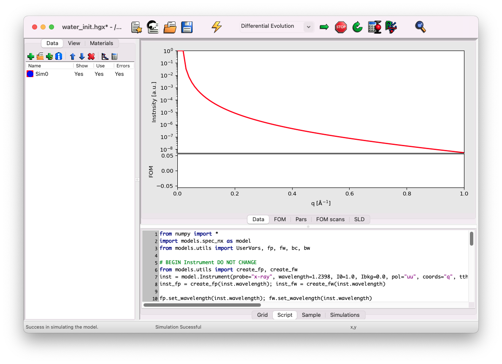

# Getting started

In this tutorial, we begin with a pre-defined, nearly empty file. You can download the GenX file [here](../../../_static/xrr/genx/water_init.hgx).

## Startup

Launch GenX and close any windows prompting you to load a configuration. You should see the main interface. Click on the folder icon to load the file `water_init.hgx` that you downloaded.

This file contains a model of a water-helium interface, but no molecules are present at the interface. To simulate the expected reflectivity, click on the thunder symbol.

After simulating, you should see a curve similar to the one below. It shows the plateau of total external reflection, with a reflectivity of $I=1$ at low q vectors. You should also see the typical decrease in the reflectivity signal, which can be approximated by the law $I \propto q^{-4}$ {cite:p}`daillant2009a`.

