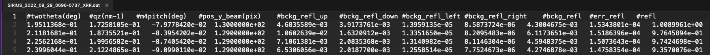
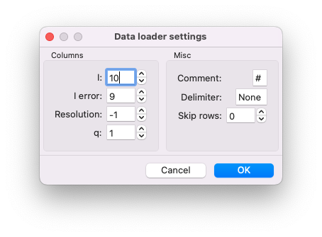

# Import data

We will see now how you can import XRR data obtained on SIRIUS. You can download example data acquired on an helium-water interface [here](../../../_static/SIRIUS_2022_09_29_0696-0737_XRR.dat).

## Set the options of the import
First, you need to tell GenX the structure of your data file. If we look at the file that you have downloaded, you see that you have 11 columns, but not all of them are necessary to plot the reflectivity curve.

Go to the menu `Settings/Import/` to set up the data loader. The column numbering of GenX starts at 0 (the first column is the column 0). GenX asks for the column number of the intensity, column `#refl` number 10 in our case, the error on the intensity, column `#err_refl` number 9, and the q value, column `#qz(nm-1)` number 1. You can leave the entry `Resolution` at $-1$ and leave the `Misc` parameters at they are.

