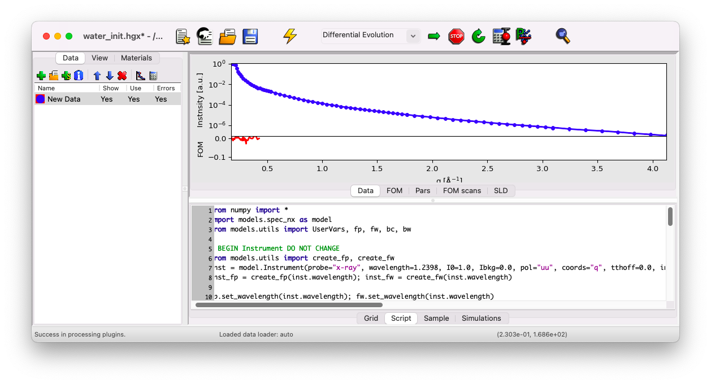
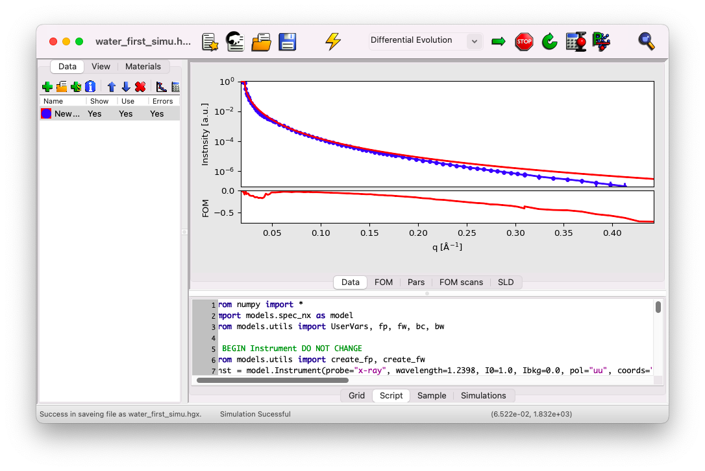

# Import data

In this section, we'll learn how to import XRR data obtained on SIRIUS. Example data acquired from a helium-water interface can be downloaded [here](../../../_static/xrr/genx/SIRIUS_2024_09_20_4446-4530_XRR.dat) (right-click>Save link as).

## Create an empty dataset

First, create an empty dataset to host the data that will be imported by clicking on the + symbol.

A new dataset named `Data 2` should appear below `Sim0`.

Next, delete the `Sim0` dataset, as it won't be needed. Select `Sim0` and click on the X symbol.

## Configure import options: only for files before 2024

*If your data have been acquired in 2024 or later, you can skip this part and directly go to **Import the data file**. You can skip this part for the file used in this tutorial.*

Depending on the structure of your data file, you need to configure GenX to understand the structure of the file you want to import. Looking at the file header below, you'll notice it has 11 columns, but not all of them are necessary for plotting the reflectivity curve.

In such a case, you need to go to the menu `Settings/Import/` to set up the data loader. In GenX, column numbering starts at 0 (the first column is column 0). With this data file, you would configure the following:

- **Intensity**: Column `#refl` (number 10)
- **Error on Intensity**: Column `#err_refl` (number 9)
- **q Value**: Column `#qz(nm-1)` (number 1)

Leave the `Resolution` entry at `-1` and keep the `Misc` parameters as they are.

## Import the data file

Select the `Data 2` dataset and click on the import icon to load the data file.

Choose and import the file `SIRIUS_2024_09_20_4446-4530_XRR.dat`. The data should appear in blue in the preview window.

## Correct q units

Notice that GenX plots data using q in $A^{-1}$, while the data is in ${\rm nm}^{-1}$. To convert the units, select the `New Data` dataset and click on the calculator icon.

Divide the `x` column by 10.

## Deactivate error bars (if needed)

In some cases, error bars might be larger than the corresponding data points. This isn't generally an issue, as error bars indicate the range within which the data should lie. However, in log scale, this may cause the points not to display. To address this, right-click on the dataset and select `Toggle Errorbars`.

In the data set used for this example, you do not need to deactivate the error bars.

## Simulate the results

Click on the thunder icon to simulate the curve and compare it to the data. If the curve isn't fully visible, right-click on the plot and select `Zoom All` to adjust the view.

The match between the simulation and the data should be fairly good, except for large q vectors. Next, we'll discuss how to verify the beam parameters in GenX.

If you've missed any steps, you can download the updated file [here](../../../_static/xrr/genx/water_first_simu.hgx).
