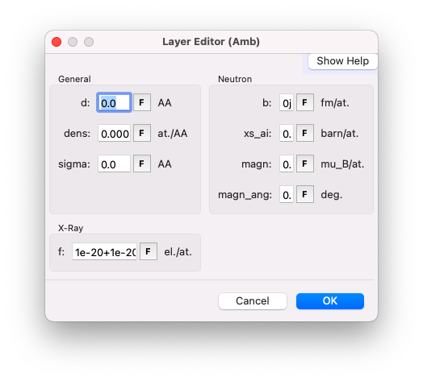
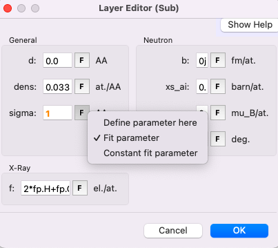

# Sample parameters

Now we will learn through this simple example what each parameter means, how you can tune them, and how the different displays work.

## Sample tab

The sample tab is where you create your model. In our example, you will notice that there are only two semi-infinite layers: the substrate (actually a sub-phase) `Sub` and, above it, the atmosphere `Amb`. We will see how to add an extra layer in a future section. For now, let’s focus on the meaning and options of each parameter.

To open the sample editor, double-click on one of the layers. In this editor, you can change parameter values and define whether a parameter is a constant or a fit parameter by clicking on the `F` symbol.

## Parameters of each layer

### Thickness

The layer thickness is represented by `d`, in angströms. Leave the value as $0$ for the semi-infinite top and bottom media.

### Density

The density (parameter `dens`) in GenX is arguably the most challenging parameter to understand. The unit is the density of formula units, expressed in units per $\rm{A}^3$. This choice of units is well-suited for systems relevant to hard-condensed matter but less intuitive for soft matter. Here are two examples to illustrate this unit:

- A crystal of $\rm SrTiO_3$ with a cubic structure of parameter $a = 3.9045 \, \rm{A}$. You have one formula unit ($\rm SrTiO_3$) per $a^3$, so the density in the units required by GenX is $1/3.9045^3 = 0.0168$.
- A Body-Centered Cubic (BCC) structure of $\rm Fe$. This structure contains two formula units ($\rm Fe$) per $a^3$, so the density is $2/a^3$.

In soft matter systems, however, a crystal is not necessarily present. A useful relation for these systems is:

$$
\rm{dens} = \frac{\rho \left[ \rm{kg/m^3} \right]}{1660.54 \times \rm{u_{scatt}}},
$$

where $\rho$ is the specific mass in $\rm{kg/m^3}$, and $\rm{u_{scatt}} = \sum_i u_i x_i$ is the linear combination of the individual atomic masses of each element.

#### *Example: $\rm H_2O$*

For example, for $\rm H_2O$:

- $\rho = 1 \, \rm{g/cm^3} = 1000 \, \rm{kg/m^3}$,
- $\rm{u_{scatt}} = 2 \times 1.008 + 1 \times 15.999 = 18.015$,

and the density in the appropriate units is:

$$
\rm{dens} = \frac{1000}{1660.54 \times 18.015} = 0.03343.
$$

#### *Example: $\rm SrTiO_3$*

We can recover the result obtained with $\rm SrTiO_3$ using this new approach:

- $\rho = 5.12 \, \rm{g/cm^3}$,
- $\rm{u_{scatt}} = 1 \times 87.62 + 1 \times 47.87 + 3 \times 16 = 183.49$,

and the density in the appropriate units is:

$$
\rm{dens} = \frac{5120}{1660.54 \times 183.49} = 0.0168.
$$

#### *Link with the electron density: example of a lipid head*

A more natural unit for density in XRR studies of soft matter systems is the electron density, $\rho_{el}$ (number of electrons per unit volume). A useful reference is the electron density of water: $\rho_{el} = 0.33 \, \rm{e}^{-}/\rm{A}^{3}$. Later in this tutorial, you will see that one of the outputs of GenX is the electron density profile, which provides $\rho_{el}$ as a function of $z$, the depth in your sample.

If you know the electron density in $\rm{e}^{-}/\rm{A}^{3}$ and the number of electrons ${n_{el}}$ in the formula unit, the parameter `dens` can be calculated using:

$$
{\rm dens} = \frac{\rho_{el}}{n_{el}}.
$$

For example, consider the head group of the phospholipid DSPC with the formula $\rm{C_{10}H_{18}O_{8}NP}$. If we aim for an electron density of $0.4 \, \rm{e}^{-}/\rm{A}^{3}$, we calculate:

$$
{\rm dens} = \frac{0.4}{10 \times 6 + 18 \times 1 + 8 \times 8 + 7 + 15} = 0.00244
$$

### Roughness
The root mean square roughness of the top interface of a layer is parameterized by `sigma`. You can set the parameter `sigma` of the sub-phase as a fit parameter, which we will optimize later.

### Formula
The simplest way to use the `f` parameter (the x-ray scattering length per formula unit, in electrons) is to input the chemical formula of your layer as a linear combination of $\rm fp$. For example, `fp.Si + 2*fp.O` for $\rm SiO_2$ or `2*fp.H + fp.O` for $\rm H_2O$.

### Neutrons
Leave all the other parameters, which are relevant only for neutrons, set to $0$.
