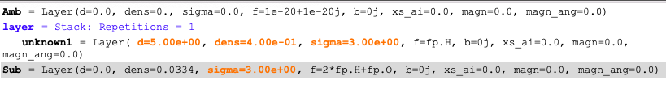
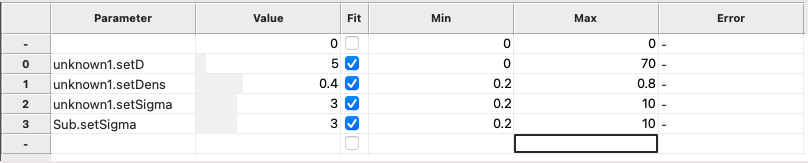
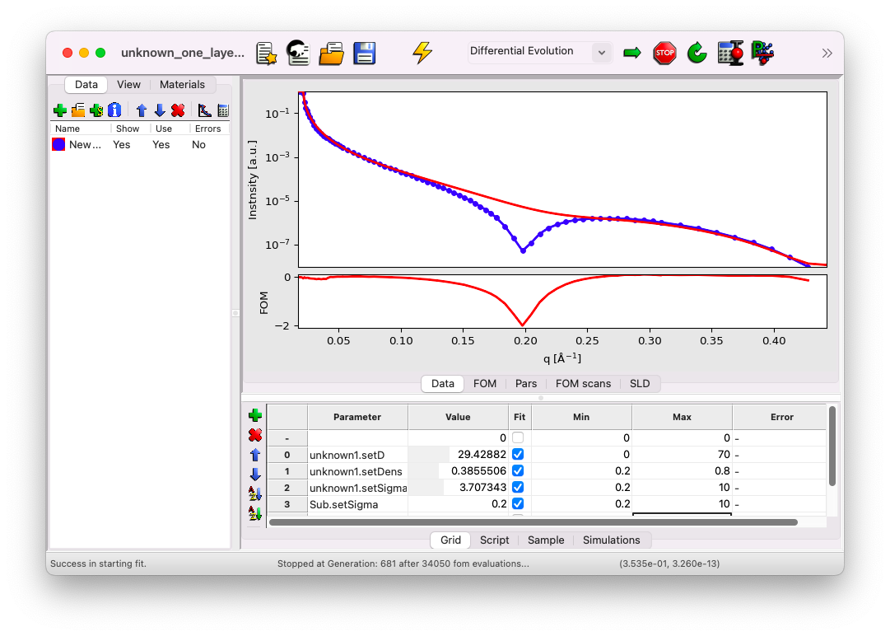
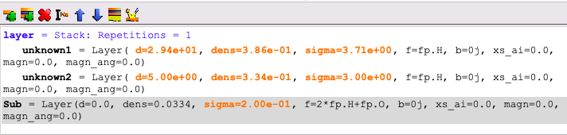
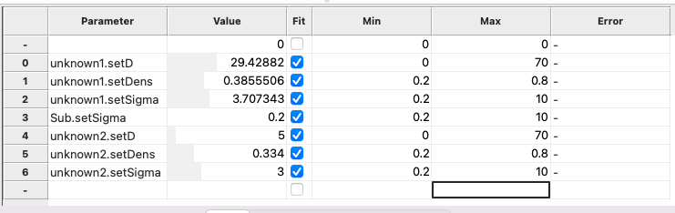
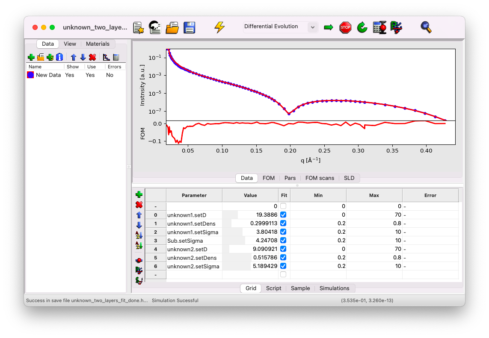
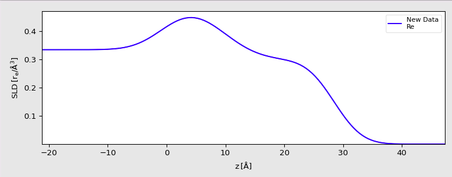

# Unknown model: where to start?

This section outlines an approach you can take when you have only a vague idea of the structure being analyzed. It’s important to emphasize that interpreting XRR results requires caution, as **an XRR curve can be well-fitted by very different models**.

The starting point will be the same data as used in the previous [section](content:build-model): a monolayer of DPPS at the air-water interface. The data file can be downloaded [here](../../../_static/xrr/genx/SIRIUS_2024_09_20_4556-4640_XRR.dat) (right-click > Save link as). We will use a simple GenX file where the data has already been imported, available [here](../../../_static/xrr/genx/unknown_init.hgx). If you're unsure how to implement parameters in GenX to build a model for your sample, refer to the previous sections.

## Start with one layer

To begin, we’ll see if a single layer is sufficient to describe the data. Add a stack, and within it, create a layer named `unknown1`.

### Sample parameters

#### **Thickness ($d$)**

Start by assigning any initial value for the layer thickness. Here, we use $d=5$ $\rm{A}$. Make this a fit parameter.

#### **Formula ($f$)**

We use a convenient trick to work directly with electron densities ($\rm{e}^{-}/\rm{A}^3$): specify only a Hydrogen atom for the formula by setting `f=fp.H`.

#### **Density ($\rm{dens}$)**

Begin with the density of water, $\rho_{el} = 0.334$ $\rm{e}^{-}/\rm{A}^3$. Set `dens=0.334` and make it a fit parameter.

#### **Roughness ($\rm{\sigma}$)**

Start with ${\rm \sigma} = 3$ $\rm A$. Make this a fit parameter.

#### **Roughness of the Subphase**

Retain the value ${\rm \sigma} = 3$ $\rm A$ for the subphase and make it a fit parameter as well.

After setting up the single-layer model, your sample view should look like this:

### Adjust the fit range
Set the fitting range for each parameter to a very large range, then start the fit.

### Fit result
As shown below, the model cannot adequately fit the data. This indicates that a single layer is insufficient to describe the sample.

## Add a second layer

### Sample parameters & fit range

Introduce a second layer, using the same parameters as the first layer. Be sure to adjust the fitting range appropriately.

### Fit result
After performing the fit, you will observe a significantly improved match between the model and the data. This demonstrates that a two-layer model is sufficient to describe your sample.

## Warning
Compare these results with those obtained in the [previous section](content:build-model:fit) using the same original dataset. While the results are close, they are not identical.

It is crucial to remember that, in extreme cases, two very different models can provide a perfect fit to the same data. This highlights the importance of complementing XRR with other techniques to identify the best model accurately.

