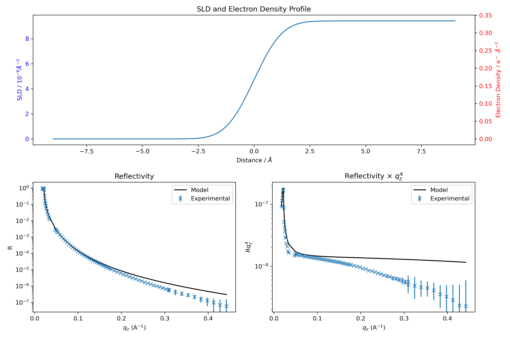

# Create a model

The next cell creates a very simple model for this first part of the tutorial. It consists of a semi-infinite bulk of helium atmosphere on top of a semi-infinite bulk of water. There is only one tunable parameter: the roughness of the interface. Here, we build an initial guess for the model, which we will later compare with and fit to the experimental data.

## Define SLDs
First, we need to define the SLDs (Scattering Length Densities) of the materials. refnx expects SLDs to be in units of $10^{-6} \, A^{-2}$. However, it is often more convenient and intuitive to work with electron densities in $e^{-}/A^3$. We therefore define the electron densities of the two media at the beginning of the cell, and later convert them to units suitable for refnx.

```python
# Electron density in e-/A^3
rho_water = 0.334
rho_helium = 0.

# Conversion to SLD = r_el*rho_el
# SLD in refnx should be in 1e-6 A^-2
r_el =  2.81794e-5 # in A
SLD_water = rho_water*r_el*1e6
SLD_helium = rho_helium*r_el*1e6

# Define a medium by its SLD
water = SLD(SLD_water, name = 'water')
helium = SLD(SLD_helium, name = 'helium')
```

## Define each slab

Next, we define each slab that will be used in the final stack. In this case, we need two slabs: one for each semi-infinite medium. The first number represents the slab thickness (set to 0 for a semi-infinite medium) in Ångströms, and the second is the roughness with respect to the layer above it.

```python
# All lengths in A
# First number is the thickness
# Second number is the roughness (with respect to the top layer)

# Semi-infinite bulk : thickness := 0
water_bulk = water(0,1)

# Semi-infinite bulk : thickness := 0
helium_atm = helium(0,0)
```

## Construct the stack

We construct the stack from top to bottom, using `| to separate each slab.

```python
# From top to bottom
stack = helium_atm | water_bulk
```

## Simulate XRR of initial guess

Finally, the XRR corresponding to this initial guess is calculated and plotted against the experimental data.

```python
model = ReflectModel(stack, bkg=0, dq=0.1)
```

 We assume that the background correction is perfect and the background can be set to zero. We use a constant intrumental resolution of $dQ/Q=0.1\%$ that is usually sufficient to describe experimental data. See [here](https://refnx.readthedocs.io/en/latest/faq.html) if a more complex resolution function is needed.



