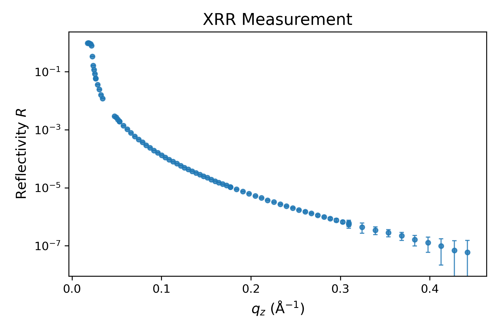

# Import & plot data

The next cell imports the file `SIRIUS_2024_09_20_4446-4530_XRR.dat` located in the `raw_data` folder. This file is a text-based dataset acquired on SIRIUS by measuring the X-ray reflectivity of a simple water–helium interface. Run the cell as is. If you wish to use it with your own data, simply replace the file path.

```python
# Path to the XRR file
path_XRR = 'raw_data/SIRIUS_2024_09_20_4446-4530_XRR.dat'

# Create folder to store the results
filename = os.path.splitext(os.path.basename(path_XRR))[0]
folder_path = f"processed_data/{filename}"
os.makedirs(folder_path, exist_ok=True)

# Import and convert to appropriate format
column_names = [col.lstrip("#") for col in open(path_XRR).readline().split()]
data_exp_temp = pd.read_csv(path_XRR, delim_whitespace=True, comment="#", names=column_names)

qz_exp = data_exp_temp["qz(nm-1)"].to_numpy() / 10.  # Convert nm⁻¹ to Å⁻¹
R_exp = data_exp_temp["refl"].to_numpy()
R_err_exp = data_exp_temp["err_refl"].to_numpy()

# Construct the data for refnx
data_exp = Data1D(data=(qz_exp, R_exp, R_err_exp))

...
```

The text file contains several columns. We extract only those corresponding to the wavevector $q_z$, the reflectivity $R$, and its absolute error $R_{\rm err}$. The wavevector $q_z$ is converted to units of $A^{-1}$, as required by refnx. Note that $R_{\rm err}$ results from a simple background subtraction, performed by taking ROIs on the 2D detector—either from the left/right or top/bottom of the reflected beam. If a more sophisticated background subtraction is required, it should be performed separately beforehand.


